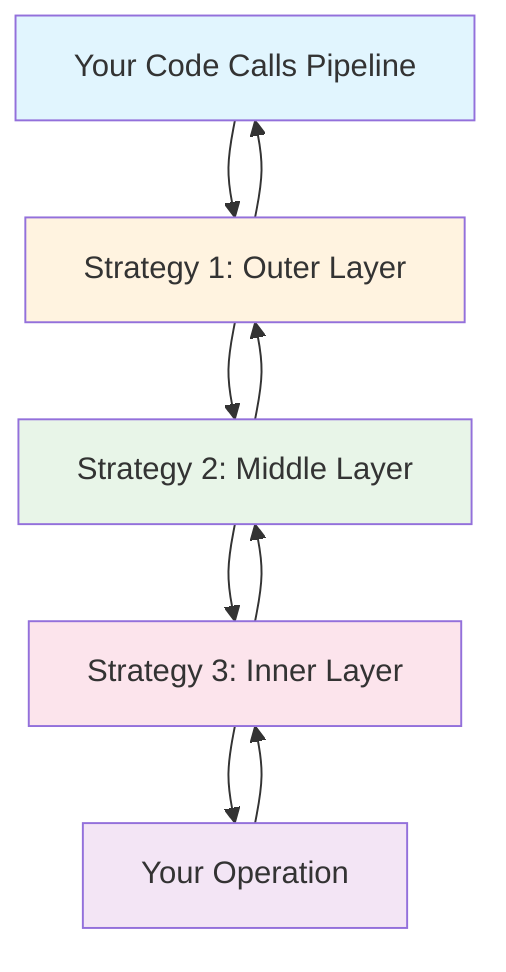

# Combining Strategies

One of Polly Dart's most powerful features is the ability to combine multiple resilience strategies into a single pipeline. This creates layered defense mechanisms that work together to handle different types of failures and optimize performance.

## Strategy Execution Order

Strategies are applied in the order they are added to the pipeline, creating a nested execution flow. Understanding this order is crucial for effective combinations.



### Execution Flow Example

```dart
final pipeline = ResiliencePipelineBuilder()
    .addRetry(RetryStrategyOptions(maxRetryAttempts: 3))      // Outer
    .addCircuitBreaker(CircuitBreakerStrategyOptions(...))   // Middle  
    .addTimeout(Duration(seconds: 5))                        // Inner
    .build();

// Execution flow:
// 1. Retry wraps everything
// 2. Circuit Breaker wraps Timeout + Operation
// 3. Timeout wraps Operation
// 4. Operation executes
```

## Recommended Strategy Combinations

### 🏗️ **Basic Resilience Pattern**
The foundation for most applications:

```dart
final basicPipeline = ResiliencePipelineBuilder()
    .addRetry(RetryStrategyOptions(
      maxRetryAttempts: 3,
      backoffStrategy: ExponentialBackoffStrategy(
        baseDelay: Duration(milliseconds: 100),
        maxDelay: Duration(seconds: 1),
      ),
    ))
    .addTimeout(Duration(seconds: 10))
    .build();

// Use case: Basic HTTP requests, database calls
```

### 🛡️ **Defensive Pattern**
Comprehensive protection with fallback:

```dart
final defensivePipeline = ResiliencePipelineBuilder()
    .addRetry(RetryStrategyOptions(maxRetryAttempts: 2))
    .addCircuitBreaker(CircuitBreakerStrategyOptions(
      failureRatio: 0.5,
      minimumThroughput: 10,
      breakDuration: Duration(seconds: 30),
    ))
    .addTimeout(Duration(seconds: 5))
    .addFallback(FallbackStrategyOptions.withValue(getDefaultData()))
    .build();

// Use case: Critical services with backup data available
```

### 🚀 **Performance-Optimized Pattern**
Balancing speed with reliability:

```dart
final performancePipeline = ResiliencePipelineBuilder()
    .addHedging(HedgingStrategyOptions(
      maxHedgedAttempts: 2,
      delay: Duration(milliseconds: 50),
    ))
    .addCircuitBreaker(CircuitBreakerStrategyOptions(
      failureRatio: 0.3,
      breakDuration: Duration(seconds: 15),
    ))
    .addTimeout(Duration(seconds: 3))
    .build();

// Use case: Low-latency services, real-time applications
```

### 🏭 **Resource-Controlled Pattern**
Managing load and protecting resources:

```dart
final resourceControlledPipeline = ResiliencePipelineBuilder()
    .addRateLimiter(RateLimiterStrategyOptions(
      permitLimit: 100,
      window: Duration(seconds: 1),
      queueLimit: 50,
    ))
    .addRetry(RetryStrategyOptions(
      maxRetryAttempts: 2,
      backoffStrategy: LinearBackoffStrategy(Duration(milliseconds: 200)),
    ))
    .addTimeout(Duration(seconds: 8))
    .addFallback(FallbackStrategyOptions(
      fallbackAction: (args) async => getCachedData(),
    ))
    .build();

// Use case: High-traffic APIs, database connection pools
```

## Strategy Interaction Patterns

### Retry + Circuit Breaker
```dart
// Pattern 1: Retry THEN Circuit Breaker (Recommended)
final retryThenCB = ResiliencePipelineBuilder()
    .addRetry(RetryStrategyOptions(maxRetryAttempts: 3))
    .addCircuitBreaker(CircuitBreakerStrategyOptions(
      failureRatio: 0.5,
      minimumThroughput: 5,
    ))
    .build();

// Pattern 2: Circuit Breaker THEN Retry (Less common)
final cbThenRetry = ResiliencePipelineBuilder()
    .addCircuitBreaker(CircuitBreakerStrategyOptions(
      failureRatio: 0.3,
      minimumThroughput: 10,
    ))
    .addRetry(RetryStrategyOptions(maxRetryAttempts: 2))
    .build();
```

**Pattern 1 (Recommended):**
- Retries happen for each attempt
- Circuit breaker tracks overall failure rate
- More resilient to temporary issues

**Pattern 2 (Use carefully):**
- Circuit breaker can prevent retries when open
- May be too aggressive in failure scenarios
- Useful when you want circuit breaking to override retry logic

### Hedging + Rate Limiting
```dart
final hedgingWithRateLimit = ResiliencePipelineBuilder()
    .addRateLimiter(RateLimiterStrategyOptions(
      permitLimit: 50,
      window: Duration(seconds: 1),
    ))
    .addHedging(HedgingStrategyOptions(
      maxHedgedAttempts: 2,
      delay: Duration(milliseconds: 100),
    ))
    .build();

// Rate limiter controls total request rate
// Hedging creates parallel requests within that limit
```

### Timeout + Fallback
```dart
final timeoutWithFallback = ResiliencePipelineBuilder()
    .addTimeout(Duration(seconds: 3))
    .addFallback(FallbackStrategyOptions(
      fallbackAction: (args) async {
        if (args.outcome.exception is TimeoutException) {
          return Outcome.fromResult(getQuickResponse());
        }
        return Outcome.fromResult(getDefaultResponse());
      },
    ))
    .build();

// Timeout enforces response time limits
// Fallback provides alternatives for timeouts and other failures
```

## Real-World Combination Examples

### E-commerce Product Service
```dart
class ProductService {
  // Different pipelines for different operations
  late final ResiliencePipeline _readPipeline;
  late final ResiliencePipeline _writePipeline;
  late final ResiliencePipeline _searchPipeline;

  ProductService() {
    _initializePipelines();
  }

  void _initializePipelines() {
    // Read operations: Optimized for performance with fallback
    _readPipeline = ResiliencePipelineBuilder()
        .addHedging(HedgingStrategyOptions(
          maxHedgedAttempts: 2,
          delay: Duration(milliseconds: 50),
        ))
        .addCircuitBreaker(CircuitBreakerStrategyOptions(
          failureRatio: 0.4,
          breakDuration: Duration(seconds: 20),
        ))
        .addTimeout(Duration(seconds: 3))
        .addFallback(FallbackStrategyOptions(
          fallbackAction: _getProductFromCache,
        ))
        .build();

    // Write operations: Conservative with retries
    _writePipeline = ResiliencePipelineBuilder()
        .addRetry(RetryStrategyOptions(
          maxRetryAttempts: 3,
          backoffStrategy: ExponentialBackoffStrategy(
            baseDelay: Duration(milliseconds: 200),
            maxDelay: Duration(seconds: 2),
          ),
          shouldHandle: (outcome) => 
              outcome.hasException && 
              outcome.exception is! ValidationException,
        ))
        .addCircuitBreaker(CircuitBreakerStrategyOptions(
          failureRatio: 0.6,
          breakDuration: Duration(seconds: 30),
        ))
        .addTimeout(Duration(seconds: 10))
        .build();

    // Search operations: Rate limited with performance optimization
    _searchPipeline = ResiliencePipelineBuilder()
        .addRateLimiter(RateLimiterStrategyOptions(
          permitLimit: 20,
          window: Duration(seconds: 1),
          queueLimit: 10,
        ))
        .addHedging(HedgingStrategyOptions(
          maxHedgedAttempts: 1,
          delay: Duration(milliseconds: 100),
        ))
        .addTimeout(Duration(seconds: 5))
        .addFallback(FallbackStrategyOptions.withValue(
          SearchResults.empty('Search temporarily unavailable')
        ))
        .build();
  }

  Future<Product> getProduct(int productId) async {
    return await _readPipeline.execute((context) async {
      return await productRepository.findById(productId);
    });
  }

  Future<Product> updateProduct(Product product) async {
    return await _writePipeline.execute((context) async {
      return await productRepository.save(product);
    });
  }

  Future<SearchResults> searchProducts(String query) async {
    return await _searchPipeline.execute((context) async {
      return await searchEngine.search(query);
    });
  }

  Future<Outcome<Product>> _getProductFromCache(FallbackActionArguments args) async {
    // Try multiple cache layers
    final productId = args.context.getProperty<int>('productId');
    
    // L1 Cache
    final cached = await l1Cache.get('product:$productId');
    if (cached != null) {
      return Outcome.fromResult(cached.markAsCached());
    }

    // L2 Cache
    final stored = await l2Cache.get('product:$productId');
    if (stored != null) {
      return Outcome.fromResult(stored.markAsStale());
    }

    // Placeholder
    return Outcome.fromResult(Product.placeholder(productId));
  }
}
```

### Financial Trading Platform
```dart
class TradingPlatform {
  late final ResiliencePipeline _marketDataPipeline;
  late final ResiliencePipeline _orderExecutionPipeline;
  late final ResiliencePipeline _riskCheckPipeline;

  TradingPlatform() {
    _initializePipelines();
  }

  void _initializePipelines() {
    // Market data: Ultra-low latency with aggressive hedging
    _marketDataPipeline = ResiliencePipelineBuilder()
        .addHedging(HedgingStrategyOptions(
          maxHedgedAttempts: 3,
          delay: Duration(milliseconds: 5),
          actionGenerator: (attempt) => _fetchFromProvider(attempt),
        ))
        .addTimeout(Duration(milliseconds: 100))
        .addFallback(FallbackStrategyOptions(
          fallbackAction: _getLastKnownPrice,
        ))
        .build();

    // Order execution: Reliable with controlled retries
    _orderExecutionPipeline = ResiliencePipelineBuilder()
        .addRateLimiter(RateLimiterStrategyOptions(
          permitLimit: 1000,
          window: Duration(seconds: 1),
        ))
        .addRetry(RetryStrategyOptions(
          maxRetryAttempts: 2,
          backoffStrategy: FixedBackoffStrategy(Duration(milliseconds: 50)),
          shouldHandle: (outcome) => _isRetryableOrderError(outcome),
        ))
        .addCircuitBreaker(CircuitBreakerStrategyOptions(
          failureRatio: 0.1, // Very low tolerance
          minimumThroughput: 100,
          breakDuration: Duration(seconds: 5),
        ))
        .addTimeout(Duration(milliseconds: 500))
        .build();

    // Risk checking: Fast with fallback to conservative limits
    _riskCheckPipeline = ResiliencePipelineBuilder()
        .addTimeout(Duration(milliseconds: 200))
        .addFallback(FallbackStrategyOptions(
          fallbackAction: _getConservativeRiskLimits,
        ))
        .build();
  }

  Future<MarketData> getMarketData(String symbol) async {
    return await _marketDataPipeline.execute((context) async {
      context.setProperty('symbol', symbol);
      return await primaryDataProvider.getPrice(symbol);
    });
  }

  Future<OrderResult> executeOrder(Order order) async {
    // Multi-stage execution with different pipelines
    
    // 1. Risk check (fast fallback)
    final riskCheck = await _riskCheckPipeline.execute((context) async {
      return await riskEngine.validateOrder(order);
    });

    if (!riskCheck.isApproved) {
      throw OrderRejectedException('Risk check failed: ${riskCheck.reason}');
    }

    // 2. Order execution (reliable)
    return await _orderExecutionPipeline.execute((context) async {
      return await orderExecutor.submitOrder(order);
    });
  }

  Future<Outcome<MarketData>> _fetchFromProvider(int attempt) async {
    final providers = [primaryProvider, secondaryProvider, tertiaryProvider];
    final provider = providers[attempt % providers.length];
    
    return Outcome.fromResult(await provider.getPrice(symbol));
  }

  bool _isRetryableOrderError(Outcome outcome) {
    if (!outcome.hasException) return false;
    
    final exception = outcome.exception;
    return exception is TimeoutException ||
           exception is SocketException ||
           (exception is OrderException && exception.isRetryable);
  }
}
```

### Microservices API Gateway
```dart
class ApiGateway {
  final Map<String, ResiliencePipeline> _servicePipelines = {};

  void registerService(String serviceName, ServiceConfig config) {
    _servicePipelines[serviceName] = _createServicePipeline(config);
  }

  ResiliencePipeline _createServicePipeline(ServiceConfig config) {
    final builder = ResiliencePipelineBuilder();

    // Rate limiting (always first for traffic control)
    builder.addRateLimiter(RateLimiterStrategyOptions(
      permitLimit: config.rateLimit,
      window: Duration(seconds: 1),
      queueLimit: config.queueLimit,
    ));

    // Hedging for performance-critical services
    if (config.isPerformanceCritical) {
      builder.addHedging(HedgingStrategyOptions(
        maxHedgedAttempts: 2,
        delay: Duration(milliseconds: config.hedgingDelay),
      ));
    }

    // Retry with service-specific configuration
    builder.addRetry(RetryStrategyOptions(
      maxRetryAttempts: config.maxRetries,
      backoffStrategy: ExponentialBackoffStrategy(
        baseDelay: Duration(milliseconds: config.retryBaseDelay),
        maxDelay: Duration(seconds: config.retryMaxDelay),
      ),
      shouldHandle: (outcome) => config.shouldRetry(outcome),
    ));

    // Circuit breaker with service-specific thresholds
    builder.addCircuitBreaker(CircuitBreakerStrategyOptions(
      failureRatio: config.circuitBreakerThreshold,
      minimumThroughput: config.minimumThroughput,
      breakDuration: Duration(seconds: config.breakDuration),
    ));

    // Timeout
    builder.addTimeout(Duration(seconds: config.timeoutSeconds));

    // Fallback for services that support it
    if (config.hasFallback) {
      builder.addFallback(FallbackStrategyOptions(
        fallbackAction: config.fallbackAction,
      ));
    }

    return builder.build();
  }

  Future<Response> forwardRequest(String serviceName, Request request) async {
    final pipeline = _servicePipelines[serviceName];
    if (pipeline == null) {
      throw ServiceNotFoundException('Service not registered: $serviceName');
    }

    return await pipeline.execute((context) async {
      context.setProperty('serviceName', serviceName);
      context.setProperty('requestId', request.id);
      
      return await httpClient.forward(serviceName, request);
    });
  }
}

class ServiceConfig {
  final int rateLimit;
  final int queueLimit;
  final bool isPerformanceCritical;
  final int hedgingDelay;
  final int maxRetries;
  final int retryBaseDelay;
  final int retryMaxDelay;
  final double circuitBreakerThreshold;
  final int minimumThroughput;
  final int breakDuration;
  final int timeoutSeconds;
  final bool hasFallback;
  final FallbackAction? fallbackAction;
  final bool Function(Outcome) shouldRetry;

  ServiceConfig({
    required this.rateLimit,
    required this.queueLimit,
    required this.isPerformanceCritical,
    required this.hedgingDelay,
    required this.maxRetries,
    required this.retryBaseDelay,
    required this.retryMaxDelay,
    required this.circuitBreakerThreshold,
    required this.minimumThroughput,
    required this.breakDuration,
    required this.timeoutSeconds,
    required this.hasFallback,
    required this.shouldRetry,
    this.fallbackAction,
  });

  // Predefined configurations
  static ServiceConfig get criticalService => ServiceConfig(
    rateLimit: 1000,
    queueLimit: 500,
    isPerformanceCritical: true,
    hedgingDelay: 50,
    maxRetries: 2,
    retryBaseDelay: 100,
    retryMaxDelay: 1,
    circuitBreakerThreshold: 0.2,
    minimumThroughput: 50,
    breakDuration: 10,
    timeoutSeconds: 3,
    hasFallback: true,
    shouldRetry: (outcome) => outcome.hasException && 
                              outcome.exception is! ClientException,
  );

  static ServiceConfig get standardService => ServiceConfig(
    rateLimit: 500,
    queueLimit: 100,
    isPerformanceCritical: false,
    hedgingDelay: 100,
    maxRetries: 3,
    retryBaseDelay: 200,
    retryMaxDelay: 2,
    circuitBreakerThreshold: 0.5,
    minimumThroughput: 20,
    breakDuration: 30,
    timeoutSeconds: 10,
    hasFallback: false,
    shouldRetry: (outcome) => outcome.hasException && 
                              outcome.exception is! ValidationException,
  );
}
```

## Advanced Combination Techniques

### Conditional Strategy Application
Apply different strategies based on context:

```dart
class AdaptivePipeline {
  final ResiliencePipeline _fastPipeline;
  final ResiliencePipeline _reliablePipeline;
  final ResiliencePipeline _fallbackPipeline;

  AdaptivePipeline()
      : _fastPipeline = ResiliencePipelineBuilder()
            .addHedging(HedgingStrategyOptions(maxHedgedAttempts: 2))
            .addTimeout(Duration(seconds: 1))
            .build(),
        _reliablePipeline = ResiliencePipelineBuilder()
            .addRetry(RetryStrategyOptions(maxRetryAttempts: 3))
            .addCircuitBreaker(CircuitBreakerStrategyOptions(failureRatio: 0.5))
            .addTimeout(Duration(seconds: 5))
            .build(),
        _fallbackPipeline = ResiliencePipelineBuilder()
            .addFallback(FallbackStrategyOptions.withValue(getDefaultData()))
            .build();

  Future<T> execute<T>(
    Future<T> Function(ResilienceContext) operation, {
    required OperationPriority priority,
    required bool allowFallback,
  }) async {
    ResiliencePipeline pipeline;

    switch (priority) {
      case OperationPriority.realTime:
        pipeline = _fastPipeline;
        break;
      case OperationPriority.standard:
        pipeline = _reliablePipeline;
        break;
      case OperationPriority.background:
        pipeline = allowFallback ? _fallbackPipeline : _reliablePipeline;
        break;
    }

    return await pipeline.execute(operation);
  }
}

enum OperationPriority { realTime, standard, background }
```

### Nested Pipeline Composition
Create pipelines that use other pipelines:

```dart
class ComposedPipeline {
  final ResiliencePipeline _l1Pipeline;
  final ResiliencePipeline _l2Pipeline;

  ComposedPipeline()
      : _l1Pipeline = ResiliencePipelineBuilder()
            .addTimeout(Duration(milliseconds: 500))
            .build(),
        _l2Pipeline = ResiliencePipelineBuilder()
            .addRetry(RetryStrategyOptions(maxRetryAttempts: 2))
            .addTimeout(Duration(seconds: 2))
            .addFallback(FallbackStrategyOptions.withValue(getBackupData()))
            .build();

  Future<Data> getData(String key) async {
    return await _l2Pipeline.execute((context) async {
      // Try fast cache first
      try {
        return await _l1Pipeline.execute((ctx) async {
          return await fastCache.get(key);
        });
      } catch (e) {
        // Fall back to slower, more reliable source
        return await database.get(key);
      }
    });
  }
}
```

## Testing Strategy Combinations

### Integration Testing
```dart
import 'package:test/test.dart';
import 'package:polly_dart/polly_dart.dart';

void main() {
  group('Strategy Combination Tests', () {
    test('should handle failures with retry then circuit breaker', () async {
      var attemptCount = 0;
      final pipeline = ResiliencePipelineBuilder()
          .addRetry(RetryStrategyOptions(maxRetryAttempts: 3))
          .addCircuitBreaker(CircuitBreakerStrategyOptions(
            failureRatio: 0.5,
            minimumThroughput: 2,
          ))
          .build();

      // Should retry and eventually succeed
      final result = await pipeline.execute((context) async {
        attemptCount++;
        if (attemptCount < 3) {
          throw Exception('Temporary failure');
        }
        return 'success';
      });

      expect(result, equals('success'));
      expect(attemptCount, equals(3));
    });

    test('should respect rate limits in hedging strategy', () async {
      var requestCount = 0;
      final pipeline = ResiliencePipelineBuilder()
          .addRateLimiter(RateLimiterStrategyOptions(
            permitLimit: 5,
            window: Duration(seconds: 1),
          ))
          .addHedging(HedgingStrategyOptions(
            maxHedgedAttempts: 3,
            delay: Duration(milliseconds: 10),
            actionGenerator: (attempt) async {
              requestCount++;
              await Future.delayed(Duration(milliseconds: 100));
              return Outcome.fromResult('hedged-$attempt');
            },
          ))
          .build();

      final futures = List.generate(10, (index) async {
        try {
          return await pipeline.execute((context) async {
            requestCount++;
            await Future.delayed(Duration(milliseconds: 200));
            return 'primary';
          });
        } catch (e) {
          return 'rate-limited';
        }
      });

      final results = await Future.wait(futures);
      
      // Some requests should be rate limited
      expect(results.where((r) => r == 'rate-limited').length, greaterThan(0));
      
      // Total requests should respect rate limit
      expect(requestCount, lessThanOrEqualTo(20)); // Accounting for hedging
    });
  });
}
```

## Best Practices for Strategy Combinations

### ✅ **Do**

**Layer Strategies Logically**
```dart
// ✅ Good: Logical layering
.addRateLimiter(...)      // Control traffic first
.addRetry(...)            // Then handle failures
.addCircuitBreaker(...)   // Prevent cascading failures
.addTimeout(...)          // Enforce time limits
.addFallback(...)         // Provide alternatives
```

**Consider Strategy Interactions**
```dart
// ✅ Good: Compatible strategies
.addRetry(RetryStrategyOptions(maxRetryAttempts: 3))
.addTimeout(Duration(seconds: 10)) // Timeout > retry duration
```

**Use Context for Coordination**
```dart
// ✅ Good: Share information between strategies
final context = ResilienceContext();
context.setProperty('operation', 'critical');
context.setProperty('userId', userId);
```

### ❌ **Don't**

**Create Conflicting Strategies**
```dart
// ❌ Bad: Timeout too short for retries
.addRetry(RetryStrategyOptions(
  maxRetryAttempts: 5,
  backoffStrategy: ExponentialBackoffStrategy(
    baseDelay: Duration(seconds: 2),
    maxDelay: Duration(seconds: 10),
  ),
))
.addTimeout(Duration(seconds: 3)) // Will timeout before retries complete
```

**Over-Engineer Simple Scenarios**
```dart
// ❌ Bad: Too many strategies for simple operations
.addRateLimiter(...)
.addHedging(...)
.addRetry(...)
.addCircuitBreaker(...)
.addTimeout(...)
.addFallback(...) // Overkill for simple operations
```

**Ignore Performance Impact**
```dart
// ❌ Bad: Performance-killing combination
.addHedging(HedgingStrategyOptions(maxHedgedAttempts: 10))
.addRetry(RetryStrategyOptions(maxRetryAttempts: 10))
// Could result in 100+ actual requests
```

## Performance Considerations

- **Memory Usage**: Each strategy maintains state
- **CPU Overhead**: Strategy coordination and execution
- **Network Load**: Strategies like hedging and retry increase requests
- **Latency Impact**: Some strategies add latency (queuing, retries)

## Next Steps

Now that you understand strategy combinations:

1. **[Learn Custom Strategies](./custom-strategies)** - Build your own resilience patterns
2. **[Explore Monitoring](./monitoring)** - Observe pipeline behavior
3. **[Master Testing](./testing)** - Validate your resilience strategies

Strategy combinations are where Polly Dart truly shines - use them to build robust, performant applications! 🚀
