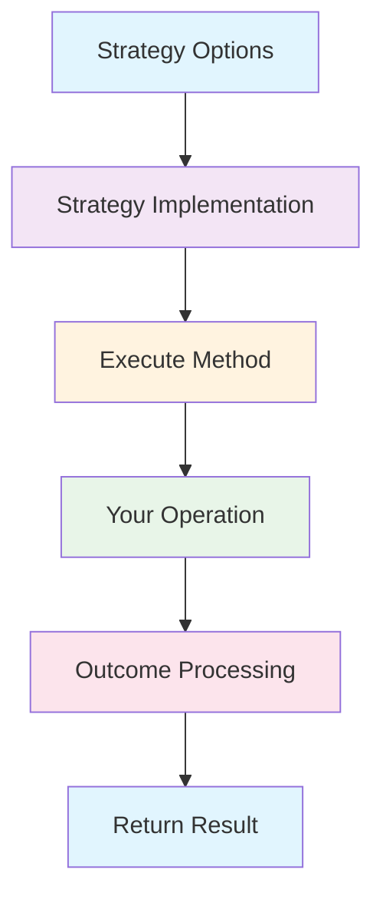

# Custom Strategies

While Polly Dart provides six comprehensive built-in strategies, you might need to create custom strategies for specific scenarios. This guide shows you how to build your own resilience strategies that integrate seamlessly with the Polly Dart pipeline.

## Understanding Strategy Architecture

Every strategy in Polly Dart implements the same core pattern:



### Core Strategy Interface

```dart
abstract class ResilienceStrategy<T> {
  Future<T> execute<T>(
    Future<T> Function(ResilienceContext context) operation,
    ResilienceContext context,
  );
}
```

## Building Your First Custom Strategy

Let's create a **Bulkhead Strategy** that isolates resources by limiting concurrent executions:

### Step 1: Define Strategy Options

```dart
class BulkheadStrategyOptions {
  final int maxConcurrency;
  final Duration? maxWaitTime;
  final OnBulkheadRejectedCallback? onRejected;

  const BulkheadStrategyOptions({
    required this.maxConcurrency,
    this.maxWaitTime,
    this.onRejected,
  });
}

typedef OnBulkheadRejectedCallback = Future<void> Function(
  OnBulkheadRejectedArguments args
);

class OnBulkheadRejectedArguments {
  final ResilienceContext context;
  final int currentConcurrency;
  final Duration waitTime;

  OnBulkheadRejectedArguments({
    required this.context,
    required this.currentConcurrency,
    required this.waitTime,
  });
}

class BulkheadRejectedException implements Exception {
  final String message;
  final int maxConcurrency;
  final int currentConcurrency;

  BulkheadRejectedException(
    this.message,
    this.maxConcurrency,
    this.currentConcurrency,
  );

  @override
  String toString() => 'BulkheadRejectedException: $message '
      '(max: $maxConcurrency, current: $currentConcurrency)';
}
```

### Step 2: Implement the Strategy

```dart
class BulkheadStrategy<T> implements ResilienceStrategy<T> {
  final BulkheadStrategyOptions _options;
  final Semaphore _semaphore;
  int _currentConcurrency = 0;

  BulkheadStrategy(this._options)
      : _semaphore = Semaphore(_options.maxConcurrency);

  @override
  Future<T> execute<T>(
    Future<T> Function(ResilienceContext context) operation,
    ResilienceContext context,
  ) async {
    final stopwatch = Stopwatch()..start();

    // Try to acquire a permit
    final acquired = await _tryAcquirePermit();
    
    if (!acquired) {
      await _handleRejection(context, stopwatch.elapsed);
      throw BulkheadRejectedException(
        'Bulkhead capacity exceeded',
        _options.maxConcurrency,
        _currentConcurrency,
      );
    }

    try {
      _currentConcurrency++;
      return await operation(context);
    } finally {
      _currentConcurrency--;
      _semaphore.release();
    }
  }

  Future<bool> _tryAcquirePermit() async {
    if (_options.maxWaitTime == null) {
      // No wait time - immediate check
      return _semaphore.tryAcquire();
    } else {
      // Wait for specified time
      return await _semaphore.acquire(_options.maxWaitTime!);
    }
  }

  Future<void> _handleRejection(ResilienceContext context, Duration waitTime) async {
    final callback = _options.onRejected;
    if (callback != null) {
      await callback(OnBulkheadRejectedArguments(
        context: context,
        currentConcurrency: _currentConcurrency,
        waitTime: waitTime,
      ));
    }
  }
}

// Helper class for concurrency control
class Semaphore {
  final int _maxCount;
  int _currentCount;
  final Queue<Completer<void>> _waitQueue = Queue<Completer<void>>();

  Semaphore(this._maxCount) : _currentCount = _maxCount;

  bool tryAcquire() {
    if (_currentCount > 0) {
      _currentCount--;
      return true;
    }
    return false;
  }

  Future<bool> acquire(Duration timeout) async {
    if (tryAcquire()) {
      return true;
    }

    final completer = Completer<void>();
    _waitQueue.add(completer);

    try {
      await completer.future.timeout(timeout);
      return true;
    } on TimeoutException {
      _waitQueue.remove(completer);
      return false;
    }
  }

  void release() {
    if (_waitQueue.isNotEmpty) {
      final completer = _waitQueue.removeFirst();
      completer.complete();
    } else {
      _currentCount++;
    }
  }
}
```

### Step 3: Integrate with Pipeline Builder

```dart
extension BulkheadExtension on ResiliencePipelineBuilder {
  ResiliencePipelineBuilder addBulkhead(BulkheadStrategyOptions options) {
    return addStrategy(BulkheadStrategy(options));
  }
}
```

### Step 4: Usage Example

```dart
final pipeline = ResiliencePipelineBuilder()
    .addBulkhead(BulkheadStrategyOptions(
      maxConcurrency: 5,
      maxWaitTime: Duration(seconds: 2),
      onRejected: (args) async {
        logger.warning('Bulkhead rejected: ${args.currentConcurrency}/${args.maxConcurrency}');
      },
    ))
    .addRetry(RetryStrategyOptions(maxRetryAttempts: 2))
    .addTimeout(Duration(seconds: 10))
    .build();

// Use the pipeline
final result = await pipeline.execute((context) async {
  return await expensiveOperation();
});
```

## Advanced Custom Strategy Examples

### Cache-First Strategy
A strategy that tries cache first, then falls back to the operation:

```dart
class CacheFirstStrategyOptions<T> {
  final CacheProvider<T> cache;
  final String Function(ResilienceContext) keyGenerator;
  final Duration? cacheTtl;
  final bool cacheOnSuccess;

  const CacheFirstStrategyOptions({
    required this.cache,
    required this.keyGenerator,
    this.cacheTtl,
    this.cacheOnSuccess = true,
  });
}

class CacheFirstStrategy<T> implements ResilienceStrategy<T> {
  final CacheFirstStrategyOptions<T> _options;

  CacheFirstStrategy(this._options);

  @override
  Future<T> execute<T>(
    Future<T> Function(ResilienceContext context) operation,
    ResilienceContext context,
  ) async {
    final cacheKey = _options.keyGenerator(context);

    // Try cache first
    try {
      final cached = await _options.cache.get(cacheKey);
      if (cached != null) {
        context.setProperty('cache_hit', true);
        return cached as T;
      }
    } catch (e) {
      // Cache error - continue to operation
      context.setProperty('cache_error', e);
    }

    // Execute operation
    final result = await operation(context);

    // Cache successful result
    if (_options.cacheOnSuccess) {
      try {
        await _options.cache.set(
          cacheKey,
          result,
          ttl: _options.cacheTtl,
        );
      } catch (e) {
        // Cache write error - don't fail the operation
        context.setProperty('cache_write_error', e);
      }
    }

    context.setProperty('cache_hit', false);
    return result;
  }
}

extension CacheFirstExtension on ResiliencePipelineBuilder {
  ResiliencePipelineBuilder addCacheFirst<T>(CacheFirstStrategyOptions<T> options) {
    return addStrategy(CacheFirstStrategy(options));
  }
}

// Usage
final pipeline = ResiliencePipelineBuilder()
    .addCacheFirst(CacheFirstStrategyOptions<UserProfile>(
      cache: redisCache,
      keyGenerator: (context) => 'user:${context.getProperty('userId')}',
      cacheTtl: Duration(minutes: 15),
    ))
    .addTimeout(Duration(seconds: 5))
    .build();
```

### Batching Strategy
Accumulates requests and executes them in batches:

```dart
class BatchingStrategyOptions<TRequest, TResponse> {
  final int batchSize;
  final Duration maxWaitTime;
  final Future<List<TResponse>> Function(List<TRequest>) batchOperation;
  final TRequest Function(ResilienceContext) requestExtractor;

  const BatchingStrategyOptions({
    required this.batchSize,
    required this.maxWaitTime,
    required this.batchOperation,
    required this.requestExtractor,
  });
}

class BatchingStrategy<TRequest, TResponse> implements ResilienceStrategy<TResponse> {
  final BatchingStrategyOptions<TRequest, TResponse> _options;
  final List<_BatchItem<TRequest, TResponse>> _pendingItems = [];
  Timer? _batchTimer;

  BatchingStrategy(this._options);

  @override
  Future<TResponse> execute<TResponse>(
    Future<TResponse> Function(ResilienceContext context) operation,
    ResilienceContext context,
  ) async {
    final request = _options.requestExtractor(context);
    final completer = Completer<TResponse>();
    
    final batchItem = _BatchItem<TRequest, TResponse>(
      request: request,
      completer: completer,
      context: context,
    );

    _pendingItems.add(batchItem);

    // Start timer if this is the first item
    if (_pendingItems.length == 1) {
      _batchTimer = Timer(_options.maxWaitTime, _processBatch);
    }

    // Process immediately if batch is full
    if (_pendingItems.length >= _options.batchSize) {
      _batchTimer?.cancel();
      await _processBatch();
    }

    return completer.future;
  }

  Future<void> _processBatch() async {
    if (_pendingItems.isEmpty) return;

    final currentBatch = List<_BatchItem<TRequest, TResponse>>.from(_pendingItems);
    _pendingItems.clear();
    _batchTimer?.cancel();

    try {
      final requests = currentBatch.map((item) => item.request).toList();
      final responses = await _options.batchOperation(requests);

      // Complete individual requests
      for (int i = 0; i < currentBatch.length && i < responses.length; i++) {
        currentBatch[i].completer.complete(responses[i]);
      }

      // Handle any unmatched requests
      for (int i = responses.length; i < currentBatch.length; i++) {
        currentBatch[i].completer.completeError(
          Exception('Batch response missing for request $i')
        );
      }
    } catch (e) {
      // Complete all with error
      for (final item in currentBatch) {
        item.completer.completeError(e);
      }
    }
  }
}

class _BatchItem<TRequest, TResponse> {
  final TRequest request;
  final Completer<TResponse> completer;
  final ResilienceContext context;

  _BatchItem({
    required this.request,
    required this.completer,
    required this.context,
  });
}

extension BatchingExtension on ResiliencePipelineBuilder {
  ResiliencePipelineBuilder addBatching<TRequest, TResponse>(
    BatchingStrategyOptions<TRequest, TResponse> options,
  ) {
    return addStrategy(BatchingStrategy(options));
  }
}

// Usage
final pipeline = ResiliencePipelineBuilder()
    .addBatching(BatchingStrategyOptions<int, UserProfile>(
      batchSize: 10,
      maxWaitTime: Duration(milliseconds: 100),
      batchOperation: (userIds) => userService.getUsers(userIds),
      requestExtractor: (context) => context.getProperty<int>('userId')!,
    ))
    .build();

// Multiple calls get batched together
final futures = [1, 2, 3, 4, 5].map((userId) async {
  final context = ResilienceContext();
  context.setProperty('userId', userId);
  return await pipeline.execute((ctx) async {
    // This won't actually be called - batching handles it
    throw UnimplementedError('Handled by batching strategy');
  }, context: context);
});

final users = await Future.wait(futures);
```

### Adaptive Load Shedding Strategy
Dynamically adjusts load based on system metrics:

```dart
class LoadSheddingStrategyOptions {
  final SystemMetricsProvider metricsProvider;
  final double cpuThreshold;
  final double memoryThreshold;
  final int maxQueueSize;
  final LoadSheddingPolicy policy;

  const LoadSheddingStrategyOptions({
    required this.metricsProvider,
    this.cpuThreshold = 0.8,
    this.memoryThreshold = 0.85,
    this.maxQueueSize = 100,
    this.policy = LoadSheddingPolicy.priority,
  });
}

enum LoadSheddingPolicy { fifo, priority, random }

class LoadSheddingStrategy<T> implements ResilienceStrategy<T> {
  final LoadSheddingStrategyOptions _options;
  final Queue<_QueuedRequest<T>> _requestQueue = Queue<_QueuedRequest<T>>();
  bool _processingQueue = false;

  LoadSheddingStrategy(this._options);

  @override
  Future<T> execute<T>(
    Future<T> Function(ResilienceContext context) operation,
    ResilienceContext context,
  ) async {
    final metrics = await _options.metricsProvider.getCurrentMetrics();
    
    // Check if we should shed load
    if (_shouldShedLoad(metrics)) {
      throw LoadSheddingException('System overloaded', metrics);
    }

    // Check queue capacity
    if (_requestQueue.length >= _options.maxQueueSize) {
      _shedOldRequests();
    }

    // Queue or execute request
    if (_shouldQueue(metrics)) {
      return await _queueRequest(operation, context);
    } else {
      return await operation(context);
    }
  }

  bool _shouldShedLoad(SystemMetrics metrics) {
    return metrics.cpuUsage > _options.cpuThreshold ||
           metrics.memoryUsage > _options.memoryThreshold;
  }

  bool _shouldQueue(SystemMetrics metrics) {
    return metrics.cpuUsage > _options.cpuThreshold * 0.7 ||
           metrics.memoryUsage > _options.memoryThreshold * 0.7;
  }

  Future<T> _queueRequest<T>(
    Future<T> Function(ResilienceContext context) operation,
    ResilienceContext context,
  ) async {
    final completer = Completer<T>();
    final priority = context.getProperty<int>('priority') ?? 0;
    
    final queuedRequest = _QueuedRequest<T>(
      operation: operation,
      context: context,
      completer: completer,
      priority: priority,
      queuedAt: DateTime.now(),
    );

    _requestQueue.add(queuedRequest);
    _processQueueIfNeeded();

    return completer.future;
  }

  void _processQueueIfNeeded() {
    if (_processingQueue || _requestQueue.isEmpty) return;

    _processingQueue = true;
    _processQueue();
  }

  Future<void> _processQueue() async {
    while (_requestQueue.isNotEmpty) {
      final metrics = await _options.metricsProvider.getCurrentMetrics();
      
      if (_shouldShedLoad(metrics)) {
        await Future.delayed(Duration(milliseconds: 100));
        continue;
      }

      final request = _getNextRequest();
      if (request == null) break;

      try {
        final result = await request.operation(request.context);
        request.completer.complete(result);
      } catch (e) {
        request.completer.completeError(e);
      }

      // Small delay to prevent CPU spinning
      await Future.delayed(Duration(milliseconds: 10));
    }

    _processingQueue = false;
  }

  _QueuedRequest<T>? _getNextRequest<T>() {
    if (_requestQueue.isEmpty) return null;

    switch (_options.policy) {
      case LoadSheddingPolicy.fifo:
        return _requestQueue.removeFirst() as _QueuedRequest<T>;
      
      case LoadSheddingPolicy.priority:
        return _removeHighestPriority() as _QueuedRequest<T>;
      
      case LoadSheddingPolicy.random:
        final index = Random().nextInt(_requestQueue.length);
        return _removeAt(index) as _QueuedRequest<T>;
    }
  }

  _QueuedRequest _removeHighestPriority() {
    var highest = _requestQueue.first;
    var highestIndex = 0;

    for (int i = 1; i < _requestQueue.length; i++) {
      final current = _requestQueue.elementAt(i);
      if (current.priority > highest.priority) {
        highest = current;
        highestIndex = i;
      }
    }

    return _removeAt(highestIndex);
  }

  _QueuedRequest _removeAt(int index) {
    final list = _requestQueue.toList();
    final item = list.removeAt(index);
    _requestQueue.clear();
    _requestQueue.addAll(list);
    return item;
  }

  void _shedOldRequests() {
    final now = DateTime.now();
    _requestQueue.removeWhere((request) {
      final age = now.difference(request.queuedAt);
      if (age > Duration(seconds: 30)) {
        request.completer.completeError(
          LoadSheddingException('Request timeout in queue', null)
        );
        return true;
      }
      return false;
    });
  }
}

class _QueuedRequest<T> {
  final Future<T> Function(ResilienceContext context) operation;
  final ResilienceContext context;
  final Completer<T> completer;
  final int priority;
  final DateTime queuedAt;

  _QueuedRequest({
    required this.operation,
    required this.context,
    required this.completer,
    required this.priority,
    required this.queuedAt,
  });
}

class SystemMetrics {
  final double cpuUsage;
  final double memoryUsage;
  final int activeConnections;

  SystemMetrics({
    required this.cpuUsage,
    required this.memoryUsage,
    required this.activeConnections,
  });
}

abstract class SystemMetricsProvider {
  Future<SystemMetrics> getCurrentMetrics();
}

class LoadSheddingException implements Exception {
  final String message;
  final SystemMetrics? metrics;

  LoadSheddingException(this.message, this.metrics);

  @override
  String toString() => 'LoadSheddingException: $message';
}
```

## Testing Custom Strategies

### Unit Testing Framework
```dart
import 'package:test/test.dart';
import 'package:mockito/mockito.dart';

class MockCacheProvider<T> extends Mock implements CacheProvider<T> {}

void main() {
  group('Custom Strategy Tests', () {
    group('BulkheadStrategy', () {
      test('should limit concurrent executions', () async {
        final strategy = BulkheadStrategy(BulkheadStrategyOptions(
          maxConcurrency: 2,
        ));

        var concurrentCount = 0;
        var maxConcurrent = 0;

        Future<String> slowOperation(ResilienceContext context) async {
          concurrentCount++;
          maxConcurrent = max(maxConcurrent, concurrentCount);
          
          await Future.delayed(Duration(milliseconds: 100));
          
          concurrentCount--;
          return 'completed';
        }

        // Start 5 operations concurrently
        final futures = List.generate(5, (index) => 
          strategy.execute(slowOperation, ResilienceContext())
        );

        await Future.wait(futures);

        expect(maxConcurrent, equals(2));
      });

      test('should reject when maxWaitTime exceeded', () async {
        final strategy = BulkheadStrategy(BulkheadStrategyOptions(
          maxConcurrency: 1,
          maxWaitTime: Duration(milliseconds: 50),
        ));

        // Start long-running operation
        final future1 = strategy.execute((context) async {
          await Future.delayed(Duration(milliseconds: 200));
          return 'first';
        }, ResilienceContext());

        // This should be rejected due to wait time
        expect(
          () => strategy.execute((context) async => 'second', ResilienceContext()),
          throwsA(isA<BulkheadRejectedException>()),
        );

        await future1;
      });
    });

    group('CacheFirstStrategy', () {
      late MockCacheProvider<String> mockCache;
      late CacheFirstStrategy<String> strategy;

      setUp(() {
        mockCache = MockCacheProvider<String>();
        strategy = CacheFirstStrategy(CacheFirstStrategyOptions<String>(
          cache: mockCache,
          keyGenerator: (context) => 'test-key',
        ));
      });

      test('should return cached value when available', () async {
        when(mockCache.get('test-key')).thenAnswer((_) async => 'cached-value');

        final result = await strategy.execute(
          (context) async => 'fresh-value',
          ResilienceContext(),
        );

        expect(result, equals('cached-value'));
        verifyNever(mockCache.set(any, any, ttl: anyNamed('ttl')));
      });

      test('should execute operation and cache result when cache miss', () async {
        when(mockCache.get('test-key')).thenAnswer((_) async => null);
        when(mockCache.set('test-key', 'fresh-value', ttl: anyNamed('ttl')))
            .thenAnswer((_) async => {});

        final result = await strategy.execute(
          (context) async => 'fresh-value',
          ResilienceContext(),
        );

        expect(result, equals('fresh-value'));
        verify(mockCache.set('test-key', 'fresh-value', ttl: anyNamed('ttl')));
      });
    });
  });
}
```

### Integration Testing
```dart
void main() {
  group('Custom Strategy Integration', () {
    test('should work with other strategies', () async {
      final pipeline = ResiliencePipelineBuilder()
          .addBulkhead(BulkheadStrategyOptions(maxConcurrency: 2))
          .addRetry(RetryStrategyOptions(maxRetryAttempts: 2))
          .addTimeout(Duration(seconds: 1))
          .build();

      var attemptCount = 0;
      final result = await pipeline.execute((context) async {
        attemptCount++;
        if (attemptCount == 1) {
          throw Exception('First attempt fails');
        }
        return 'success';
      });

      expect(result, equals('success'));
      expect(attemptCount, equals(2));
    });
  });
}
```

## Strategy Composition Patterns

### Decorator Pattern
Enhance existing strategies:

```dart
class LoggingStrategyDecorator<T> implements ResilienceStrategy<T> {
  final ResilienceStrategy<T> _innerStrategy;
  final Logger _logger;

  LoggingStrategyDecorator(this._innerStrategy, this._logger);

  @override
  Future<T> execute<T>(
    Future<T> Function(ResilienceContext context) operation,
    ResilienceContext context,
  ) async {
    final stopwatch = Stopwatch()..start();
    _logger.info('Strategy execution started');

    try {
      final result = await _innerStrategy.execute(operation, context);
      _logger.info('Strategy execution completed in ${stopwatch.elapsedMilliseconds}ms');
      return result;
    } catch (e) {
      _logger.error('Strategy execution failed: $e');
      rethrow;
    }
  }
}
```

### Strategy Factory
Create strategies based on configuration:

```dart
class StrategyFactory {
  static ResilienceStrategy<T> create<T>(StrategyConfig config) {
    switch (config.type) {
      case StrategyType.bulkhead:
        return BulkheadStrategy(config.bulkheadOptions!);
      case StrategyType.cacheFirst:
        return CacheFirstStrategy(config.cacheFirstOptions!);
      case StrategyType.loadShedding:
        return LoadSheddingStrategy(config.loadSheddingOptions!);
      default:
        throw ArgumentError('Unknown strategy type: ${config.type}');
    }
  }
}
```

## Best Practices for Custom Strategies

### ✅ **Do**

**Follow Naming Conventions**
```dart
// ✅ Good: Clear, descriptive names
class BulkheadStrategy implements ResilienceStrategy {}
class BulkheadStrategyOptions {}
class BulkheadRejectedException implements Exception {}
```

**Handle Errors Gracefully**
```dart
// ✅ Good: Proper error handling
try {
  return await operation(context);
} catch (e) {
  // Log, transform, or handle error appropriately
  await _handleError(e, context);
  rethrow;
}
```

**Use Context for State Sharing**
```dart
// ✅ Good: Share information via context
context.setProperty('cache_hit', true);
context.setProperty('execution_time', stopwatch.elapsed);
```

**Provide Comprehensive Configuration**
```dart
// ✅ Good: Flexible configuration options
class MyStrategyOptions {
  final int maxItems;
  final Duration timeout;
  final bool enableMetrics;
  final OnEventCallback? onEvent;
}
```

### ❌ **Don't**

**Block the Event Loop**
```dart
// ❌ Bad: Blocking synchronous operations
await Future.delayed(Duration.zero); // Use this instead of Thread.sleep
```

**Ignore Resource Cleanup**
```dart
// ❌ Bad: No cleanup
class MyStrategy {
  Timer? _timer;
  // Missing dispose method!
}

// ✅ Good: Proper cleanup
class MyStrategy {
  Timer? _timer;
  
  void dispose() {
    _timer?.cancel();
  }
}
```

**Break Pipeline Composition**
```dart
// ❌ Bad: Not calling inner strategies
return await operation(context); // Skips other strategies

// ✅ Good: Proper delegation
return await _innerStrategy.execute(operation, context);
```

## Performance Considerations

- **Memory Management**: Clean up resources properly
- **CPU Usage**: Avoid intensive synchronous operations
- **Concurrency**: Use appropriate async patterns
- **Metrics**: Track strategy performance and behavior

## Publishing Custom Strategies

Consider publishing useful custom strategies as separate packages:

```yaml
name: polly_dart_bulkhead
description: Bulkhead isolation strategy for Polly Dart
dependencies:
  polly_dart: ^1.0.0
```

## Next Steps

With custom strategies, you can:

1. **[Learn Monitoring](./monitoring)** - Track your custom strategy behavior
2. **[Master Testing](./testing)** - Validate custom strategy reliability
3. **[Explore Examples](../examples/)** - See real-world implementations

Custom strategies let you extend Polly Dart's capabilities to meet your unique resilience requirements! 🔧
