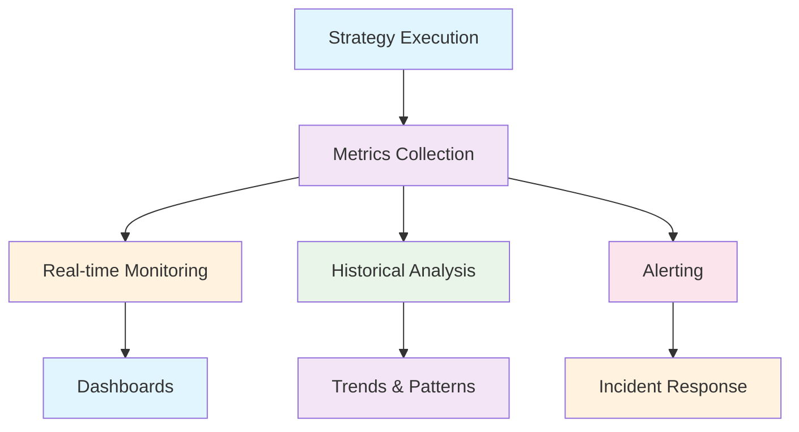

# Monitoring and Observability

Monitoring your resilience strategies is crucial for understanding system behavior, identifying bottlenecks, and optimizing performance. This guide covers comprehensive monitoring approaches for Polly Dart applications.

## Overview

Effective monitoring provides insights into:



## Built-in Monitoring Capabilities

### Strategy Events
Every strategy in Polly Dart emits events that you can monitor:

```dart
// Configure strategy with event handlers
final pipeline = ResiliencePipelineBuilder()
    .addRetry(RetryStrategyOptions(
      maxRetryAttempts: 3,
      onRetry: (args) async {
        logger.info('Retry attempt ${args.attemptNumber} for operation ${args.context.operationKey}');
        metrics.incrementCounter('polly.retry.attempts', tags: {
          'operation': args.context.operationKey ?? 'unknown',
          'attempt': args.attemptNumber.toString(),
        });
      },
    ))
    .addCircuitBreaker(CircuitBreakerStrategyOptions(
      shouldHandle: (outcome) => outcome.hasException &&
          (outcome.exception is HttpException || outcome.exception is TimeoutException),
      onOpened: (args) async {
        logger.warning('Circuit breaker opened');
        metrics.recordGauge('polly.circuit_breaker.state', 2.0, // Open = 2
          tags: {'operation': args.context.operationKey ?? 'unknown'}
        );
      },
      onClosed: (args) async {
        logger.info('Circuit breaker closed');
        metrics.recordGauge('polly.circuit_breaker.state', 0.0, // Closed = 0
          tags: {'operation': args.context.operationKey ?? 'unknown'}
        );
      },
      onHalfOpened: (args) async {
        logger.info('Circuit breaker half-opened');
        metrics.recordGauge('polly.circuit_breaker.state', 1.0, // HalfOpen = 1
          tags: {'operation': args.context.operationKey ?? 'unknown'}
        );
      },
    ))
    .addTimeout(TimeoutStrategyOptions(
      timeout: Duration(seconds: 30),
      onTimeout: (args) async {
        logger.warning('Operation timed out after ${args.timeout}');
        metrics.incrementCounter('polly.timeout.exceeded', tags: {
          'operation': args.context.operationKey ?? 'unknown',
          'timeout_ms': args.timeout.inMilliseconds.toString(),
        });
      },
    ))
    .build();
```

### Context-Based Tracking
Use `ResilienceContext` to track execution details:

```dart
Future<T> executeWithTracking<T>(
  Future<T> Function() operation,
  String operationName,
) async {
  final context = ResilienceContext();
  context.setProperty('operation_name', operationName);
  context.setProperty('start_time', DateTime.now());
  context.setProperty('correlation_id', generateCorrelationId());

  try {
    final result = await pipeline.execute((ctx) async {
      return await operation();
    }, context: context);

    _recordSuccess(context);
    return result;
  } catch (e) {
    _recordFailure(context, e);
    rethrow;
  }
}

void _recordSuccess(ResilienceContext context) {
  final startTime = context.getProperty<DateTime>('start_time')!;
  final duration = DateTime.now().difference(startTime);
  
  metrics.recordTimer('polly.operation.duration', duration, tags: {
    'operation': context.getProperty<String>('operation_name') ?? 'unknown',
    'status': 'success',
  });
}

void _recordFailure(ResilienceContext context, Object error) {
  final duration = DateTime.now().difference(
    context.getProperty<DateTime>('start_time')!
  );
  
  metrics.recordTimer('polly.operation.duration', duration, tags: {
    'operation': context.getProperty<String>('operation_name') ?? 'unknown',
    'status': 'failure',
    'error_type': error.runtimeType.toString(),
  });
}
```

## Comprehensive Metrics Collection

### Core Metrics Interface
```dart
abstract class MetricsCollector {
  void incrementCounter(String name, {Map<String, String>? tags});
  void recordGauge(String name, double value, {Map<String, String>? tags});
  void recordTimer(String name, Duration value, {Map<String, String>? tags});
  void recordHistogram(String name, double value, {Map<String, String>? tags});
}

class PrometheusMetricsCollector implements MetricsCollector {
  late final CollectorRegistry _registry;
  final Map<String, Counter> _counters = {};
  final Map<String, Gauge> _gauges = {};
  final Map<String, Histogram> _histograms = {};

  PrometheusMetricsCollector() {
    _registry = CollectorRegistry.defaultRegistry;
  }

  @override
  void incrementCounter(String name, {Map<String, String>? tags}) {
    final counter = _counters.putIfAbsent(name, () => 
      Counter(name: name, help: 'Counter for $name', labelNames: tags?.keys.toList())
        ..register(_registry)
    );
    
    if (tags != null) {
      counter.labels(tags.values.toList()).inc();
    } else {
      counter.inc();
    }
  }

  @override
  void recordTimer(String name, Duration value, {Map<String, String>? tags}) {
    recordHistogram(name, value.inMicroseconds.toDouble(), tags: tags);
  }

  @override
  void recordHistogram(String name, double value, {Map<String, String>? tags}) {
    final histogram = _histograms.putIfAbsent(name, () =>
      Histogram(
        name: name,
        help: 'Histogram for $name',
        labelNames: tags?.keys.toList(),
        buckets: [.005, .01, .025, .05, .075, .1, .25, .5, .75, 1.0, 2.5, 5.0, 7.5, 10.0],
      )..register(_registry)
    );

    if (tags != null) {
      histogram.labels(tags.values.toList()).observe(value);
    } else {
      histogram.observe(value);
    }
  }

  @override
  void recordGauge(String name, double value, {Map<String, String>? tags}) {
    final gauge = _gauges.putIfAbsent(name, () =>
      Gauge(name: name, help: 'Gauge for $name', labelNames: tags?.keys.toList())
        ..register(_registry)
    );

    if (tags != null) {
      gauge.labels(tags.values.toList()).set(value);
    } else {
      gauge.set(value);
    }
  }
}
```

### Strategy-Specific Monitoring
Create monitoring decorators for each strategy:

```dart
class MonitoredRetryStrategy<T> implements ResilienceStrategy<T> {
  final RetryStrategy<T> _inner;
  final MetricsCollector _metrics;

  MonitoredRetryStrategy(this._inner, this._metrics);

  @override
  Future<T> execute<T>(
    Future<T> Function(ResilienceContext context) operation,
    ResilienceContext context,
  ) async {
    final operationName = context.getProperty<String>('operation_name') ?? 'unknown';
    var retryCount = 0;

    return await _inner.execute((ctx) async {
      try {
        final result = await operation(ctx);
        
        // Record successful execution
        _metrics.incrementCounter('polly.retry.success', tags: {
          'operation': operationName,
          'retry_count': retryCount.toString(),
        });
        
        return result;
      } catch (e) {
        retryCount++;
        
        // Record retry attempt
        _metrics.incrementCounter('polly.retry.attempt', tags: {
          'operation': operationName,
          'error_type': e.runtimeType.toString(),
          'retry_count': retryCount.toString(),
        });
        
        rethrow;
      }
    }, context);
  }
}

class MonitoredCircuitBreakerStrategy<T> implements ResilienceStrategy<T> {
  final CircuitBreakerStrategy<T> _inner;
  final MetricsCollector _metrics;
  CircuitBreakerState _lastState = CircuitBreakerState.closed;

  MonitoredCircuitBreakerStrategy(this._inner, this._metrics);

  @override
  Future<T> execute<T>(
    Future<T> Function(ResilienceContext context) operation,
    ResilienceContext context,
  ) async {
    final operationName = context.getProperty<String>('operation_name') ?? 'unknown';

    // Record state if changed
    final currentState = _inner.state;
    if (currentState != _lastState) {
      _metrics.recordGauge('polly.circuit_breaker.state', currentState.index.toDouble(), tags: {
        'operation': operationName,
        'state': currentState.toString(),
      });
      _lastState = currentState;
    }

    try {
      final result = await _inner.execute(operation, context);
      
      _metrics.incrementCounter('polly.circuit_breaker.success', tags: {
        'operation': operationName,
        'state': currentState.toString(),
      });
      
      return result;
    } on CircuitBreakerOpenException {
      _metrics.incrementCounter('polly.circuit_breaker.rejected', tags: {
        'operation': operationName,
        'reason': 'circuit_open',
      });
      rethrow;
    } catch (e) {
      _metrics.incrementCounter('polly.circuit_breaker.failure', tags: {
        'operation': operationName,
        'error_type': e.runtimeType.toString(),
      });
      rethrow;
    }
  }
}
```

### Monitoring Pipeline Builder
Create pipelines with built-in monitoring:

```dart
class MonitoredResiliencePipelineBuilder {
  final MetricsCollector _metrics;
  final Logger _logger;
  final List<ResilienceStrategy> _strategies = [];

  MonitoredResiliencePipelineBuilder(this._metrics, this._logger);

  MonitoredResiliencePipelineBuilder addRetry(RetryStrategyOptions options) {
    final strategy = RetryStrategy(options);
    _strategies.add(MonitoredRetryStrategy(strategy, _metrics));
    return this;
  }

  MonitoredResiliencePipelineBuilder addCircuitBreaker(CircuitBreakerStrategyOptions options) {
    final strategy = CircuitBreakerStrategy(options);
    _strategies.add(MonitoredCircuitBreakerStrategy(strategy, _metrics));
    return this;
  }

  MonitoredResiliencePipelineBuilder addTimeout(Duration timeout) {
    final strategy = TimeoutStrategy(timeout);
    _strategies.add(MonitoredTimeoutStrategy(strategy, _metrics));
    return this;
  }

  ResiliencePipeline build() {
    return ResiliencePipeline(_strategies);
  }
}

// Usage
final metricsCollector = PrometheusMetricsCollector();
final logger = Logger('resilience');

final pipeline = MonitoredResiliencePipelineBuilder(metricsCollector, logger)
    .addRetry(RetryStrategyOptions(maxRetryAttempts: 3))
    .addCircuitBreaker(CircuitBreakerStrategyOptions(
      failureRatio: 0.5,
      minimumThroughput: 10,
    ))
    .addTimeout(Duration(seconds: 30))
    .build();
```

## Real-time Dashboards

### Metrics Endpoint
Expose metrics for Prometheus scraping:

```dart
import 'dart:io';
import 'package:shelf/shelf.dart';
import 'package:shelf/shelf_io.dart';

class MetricsServer {
  final MetricsCollector _metrics;
  late HttpServer _server;

  MetricsServer(this._metrics);

  Future<void> start({int port = 9090}) async {
    final handler = Pipeline()
        .addMiddleware(logRequests())
        .addHandler(_handleRequest);

    _server = await serve(handler, InternetAddress.anyIPv4, port);
    print('Metrics server listening on port ${_server.port}');
  }

  Future<void> stop() async {
    await _server.close();
  }

  Future<Response> _handleRequest(Request request) async {
    if (request.url.path == 'metrics') {
      final metricsOutput = await _generatePrometheusMetrics();
      return Response.ok(
        metricsOutput,
        headers: {'Content-Type': 'text/plain; version=0.0.4'},
      );
    }

    if (request.url.path == 'health') {
      return Response.ok('OK');
    }

    return Response.notFound('Not found');
  }

  Future<String> _generatePrometheusMetrics() async {
    // Generate Prometheus-format metrics
    return (_metrics as PrometheusMetricsCollector)._registry.collectMetricFamilySamples()
        .map((family) => family.toString())
        .join('\n');
  }
}

// Start metrics server
final metricsServer = MetricsServer(metricsCollector);
await metricsServer.start(port: 9090);
```

### Grafana Dashboard Configuration
Create a comprehensive Grafana dashboard:

```json
{
  "dashboard": {
    "title": "Polly Dart Resilience Monitoring",
    "panels": [
      {
        "title": "Request Rate",
        "type": "graph",
        "targets": [
          {
            "expr": "rate(polly_operation_total[5m])",
            "legendFormat": "{{operation}} - {{status}}"
          }
        ]
      },
      {
        "title": "Error Rate",
        "type": "graph",
        "targets": [
          {
            "expr": "rate(polly_operation_total{status=\"failure\"}[5m]) / rate(polly_operation_total[5m])",
            "legendFormat": "{{operation}}"
          }
        ]
      },
      {
        "title": "Response Time",
        "type": "graph",
        "targets": [
          {
            "expr": "histogram_quantile(0.95, rate(polly_operation_duration_bucket[5m]))",
            "legendFormat": "95th percentile"
          },
          {
            "expr": "histogram_quantile(0.50, rate(polly_operation_duration_bucket[5m]))",
            "legendFormat": "50th percentile"
          }
        ]
      },
      {
        "title": "Circuit Breaker States",
        "type": "graph",
        "targets": [
          {
            "expr": "polly_circuit_breaker_state",
            "legendFormat": "{{operation}} - {{state}}"
          }
        ]
      },
      {
        "title": "Retry Attempts",
        "type": "graph",
        "targets": [
          {
            "expr": "rate(polly_retry_attempt[5m])",
            "legendFormat": "{{operation}}"
          }
        ]
      }
    ]
  }
}
```

## Structured Logging

### Comprehensive Logging Strategy
```dart
class ResilienceLogger {
  final Logger _logger;

  ResilienceLogger(String name) : _logger = Logger(name);

  void logExecutionStart(ResilienceContext context) {
    _logger.info('Starting resilience execution', {
      'correlation_id': context.getProperty('correlation_id'),
      'operation_name': context.getProperty('operation_name'),
      'timestamp': DateTime.now().toIso8601String(),
    });
  }

  void logExecutionSuccess(ResilienceContext context, Duration duration) {
    _logger.info('Resilience execution succeeded', {
      'correlation_id': context.getProperty('correlation_id'),
      'operation_name': context.getProperty('operation_name'),
      'duration_ms': duration.inMilliseconds,
      'timestamp': DateTime.now().toIso8601String(),
    });
  }

  void logExecutionFailure(ResilienceContext context, Object error, StackTrace stackTrace) {
    _logger.error('Resilience execution failed', error, stackTrace, {
      'correlation_id': context.getProperty('correlation_id'),
      'operation_name': context.getProperty('operation_name'),
      'error_type': error.runtimeType.toString(),
      'timestamp': DateTime.now().toIso8601String(),
    });
  }

  void logRetryAttempt(int attemptNumber, Object error) {
    _logger.warning('Retry attempt', {
      'attempt_number': attemptNumber,
      'error_type': error.runtimeType.toString(),
      'error_message': error.toString(),
    });
  }

  void logCircuitBreakerStateChange(CircuitBreakerState oldState, CircuitBreakerState newState) {
    _logger.info('Circuit breaker state changed', {
      'old_state': oldState.toString(),
      'new_state': newState.toString(),
      'timestamp': DateTime.now().toIso8601String(),
    });
  }

  void logTimeout(Duration timeout) {
    _logger.warning('Operation timed out', {
      'timeout_ms': timeout.inMilliseconds,
      'timestamp': DateTime.now().toIso8601String(),
    });
  }
}

// Structured logging with context
extension LoggingExtensions on ResilienceContext {
  void addLoggingContext(String operationName) {
    setProperty('operation_name', operationName);
    setProperty('correlation_id', generateCorrelationId());
    setProperty('start_time', DateTime.now());
  }
}

String generateCorrelationId() {
  return '${DateTime.now().millisecondsSinceEpoch}-${Random().nextInt(1000000)}';
}
```

### JSON Logging for Production
```dart
class JsonLogger {
  final String _serviceName;

  JsonLogger(this._serviceName);

  void log(String level, String message, {
    Map<String, dynamic>? context,
    Object? error,
    StackTrace? stackTrace,
  }) {
    final logEntry = {
      'timestamp': DateTime.now().toUtc().toIso8601String(),
      'level': level.toUpperCase(),
      'service': _serviceName,
      'message': message,
      if (context != null) 'context': context,
      if (error != null) 'error': {
        'type': error.runtimeType.toString(),
        'message': error.toString(),
      },
      if (stackTrace != null) 'stack_trace': stackTrace.toString(),
    };

    print(jsonEncode(logEntry));
  }

  void info(String message, [Map<String, dynamic>? context]) {
    log('INFO', message, context: context);
  }

  void warning(String message, [Map<String, dynamic>? context]) {
    log('WARNING', message, context: context);
  }

  void error(String message, Object? error, StackTrace? stackTrace, [Map<String, dynamic>? context]) {
    log('ERROR', message, context: context, error: error, stackTrace: stackTrace);
  }
}
```

## Health Checks and Alerting

### Health Check Implementation
```dart
class ResilienceHealthCheck {
  final Map<String, ResiliencePipeline> _pipelines;
  final MetricsCollector _metrics;

  ResilienceHealthCheck(this._pipelines, this._metrics);

  Future<HealthCheckResult> check() async {
    final results = <String, bool>{};
    var overallHealthy = true;

    for (final entry in _pipelines.entries) {
      try {
        // Perform a lightweight health check operation
        await entry.value.execute((context) async {
          await Future.delayed(Duration(milliseconds: 10));
          return 'healthy';
        });
        results[entry.key] = true;
      } catch (e) {
        results[entry.key] = false;
        overallHealthy = false;
      }
    }

    return HealthCheckResult(
      healthy: overallHealthy,
      timestamp: DateTime.now(),
      checks: results,
    );
  }
}

class HealthCheckResult {
  final bool healthy;
  final DateTime timestamp;
  final Map<String, bool> checks;

  HealthCheckResult({
    required this.healthy,
    required this.timestamp,
    required this.checks,
  });

  Map<String, dynamic> toJson() => {
    'healthy': healthy,
    'timestamp': timestamp.toIso8601String(),
    'checks': checks,
  };
}

// Health check endpoint
Response handleHealthCheck(Request request) {
  final healthCheck = ResilienceHealthCheck(pipelines, metricsCollector);
  final result = await healthCheck.check();
  
  return Response(
    result.healthy ? 200 : 503,
    body: jsonEncode(result.toJson()),
    headers: {'Content-Type': 'application/json'},
  );
}
```

### Alerting Rules
Configure alerting based on metrics:

```yaml
# prometheus-alerts.yml
groups:
  - name: polly_dart_alerts
    rules:
      - alert: HighErrorRate
        expr: rate(polly_operation_total{status="failure"}[5m]) / rate(polly_operation_total[5m]) > 0.1
        for: 5m
        labels:
          severity: warning
        annotations:
          summary: "High error rate detected"
          description: "Error rate is {{ $value | humanizePercentage }} for operation {{ $labels.operation }}"

      - alert: CircuitBreakerOpen
        expr: polly_circuit_breaker_state == 2  # Open state
        for: 1m
        labels:
          severity: critical
        annotations:
          summary: "Circuit breaker is open"
          description: "Circuit breaker for {{ $labels.operation }} has been open for more than 1 minute"

      - alert: HighRetryRate
        expr: rate(polly_retry_attempt[5m]) > 10
        for: 2m
        labels:
          severity: warning
        annotations:
          summary: "High retry rate detected"
          description: "Retry rate is {{ $value }} attempts/second for operation {{ $labels.operation }}"

      - alert: SlowResponseTime
        expr: histogram_quantile(0.95, rate(polly_operation_duration_bucket[5m])) > 5
        for: 3m
        labels:
          severity: warning
        annotations:
          summary: "Slow response time detected"
          description: "95th percentile response time is {{ $value }}s for operation {{ $labels.operation }}"
```

## Performance Monitoring

### Custom Performance Metrics
```dart
class PerformanceMonitor {
  final MetricsCollector _metrics;
  final Map<String, Stopwatch> _activeOperations = {};

  PerformanceMonitor(this._metrics);

  void startOperation(String operationId, String operationName) {
    final stopwatch = Stopwatch()..start();
    _activeOperations[operationId] = stopwatch;
    
    _metrics.incrementCounter('polly.operation.started', tags: {
      'operation': operationName,
    });
  }

  void endOperation(String operationId, String operationName, {bool success = true}) {
    final stopwatch = _activeOperations.remove(operationId);
    if (stopwatch != null) {
      stopwatch.stop();
      
      _metrics.recordTimer('polly.operation.duration', stopwatch.elapsed, tags: {
        'operation': operationName,
        'status': success ? 'success' : 'failure',
      });
      
      _metrics.incrementCounter('polly.operation.completed', tags: {
        'operation': operationName,
        'status': success ? 'success' : 'failure',
      });
    }
  }

  void recordCustomMetric(String name, double value, Map<String, String> tags) {
    _metrics.recordGauge(name, value, tags: tags);
  }

  void trackConcurrency(String operationName) {
    final activeCount = _activeOperations.length;
    _metrics.recordGauge('polly.operation.concurrent', activeCount.toDouble(), tags: {
      'operation': operationName,
    });
  }
}

// Integration with resilience pipeline
class PerformanceTrackingStrategy<T> implements ResilienceStrategy<T> {
  final ResilienceStrategy<T> _inner;
  final PerformanceMonitor _monitor;

  PerformanceTrackingStrategy(this._inner, this._monitor);

  @override
  Future<T> execute<T>(
    Future<T> Function(ResilienceContext context) operation,
    ResilienceContext context,
  ) async {
    final operationId = generateOperationId();
    final operationName = context.getProperty<String>('operation_name') ?? 'unknown';
    
    _monitor.startOperation(operationId, operationName);
    _monitor.trackConcurrency(operationName);

    try {
      final result = await _inner.execute(operation, context);
      _monitor.endOperation(operationId, operationName, success: true);
      return result;
    } catch (e) {
      _monitor.endOperation(operationId, operationName, success: false);
      rethrow;
    }
  }
}
```

## Distributed Tracing

### OpenTelemetry Integration
```dart
import 'package:opentelemetry/api.dart' as otel;

class TracingStrategy<T> implements ResilienceStrategy<T> {
  final ResilienceStrategy<T> _inner;
  final otel.Tracer _tracer;

  TracingStrategy(this._inner, this._tracer);

  @override
  Future<T> execute<T>(
    Future<T> Function(ResilienceContext context) operation,
    ResilienceContext context,
  ) async {
    final operationName = context.getProperty<String>('operation_name') ?? 'resilience_operation';
    
    return await _tracer.startActiveSpan(operationName, (span) async {
      try {
        span.setAttributes({
          'polly.operation.name': operationName,
          'polly.correlation.id': context.getProperty<String>('correlation_id') ?? '',
        });

        final result = await _inner.execute((ctx) async {
          // Add span context to resilience context
          ctx.setProperty('trace_span', span);
          return await operation(ctx);
        }, context);

        span.setStatus(otel.StatusCode.ok);
        return result;
      } catch (e) {
        span.setStatus(otel.StatusCode.error, e.toString());
        span.recordException(e);
        rethrow;
      }
    });
  }
}

// Usage with tracing
final tracer = otel.globalTracerProvider.getTracer('polly_dart');
final pipeline = ResiliencePipelineBuilder()
    .addStrategy(TracingStrategy(
      RetryStrategy(RetryStrategyOptions(maxRetryAttempts: 3)),
      tracer,
    ))
    .build();
```

## Best Practices

### ✅ **Do**

**Use Structured Logging**
```dart
logger.info('Operation completed', {
  'operation_name': 'get_user_profile',
  'duration_ms': 150,
  'retry_count': 1,
  'cache_hit': false,
});
```

**Implement Sampling for High-Volume Operations**
```dart
class SamplingMetricsCollector implements MetricsCollector {
  final MetricsCollector _inner;
  final double _sampleRate;
  final Random _random = Random();

  SamplingMetricsCollector(this._inner, this._sampleRate);

  @override
  void recordTimer(String name, Duration value, {Map<String, String>? tags}) {
    if (_random.nextDouble() < _sampleRate) {
      _inner.recordTimer(name, value, tags: tags);
    }
  }
}
```

**Monitor Business Metrics Too**
```dart
// Track business-relevant metrics alongside technical ones
metrics.incrementCounter('orders.processed', tags: {
  'payment_method': 'credit_card',
  'region': 'us-east',
});
```

### ❌ **Don't**

**Over-Monitor Low-Value Operations**
```dart
// ❌ Bad: Monitoring every small operation
await pipeline.execute(
  (context) => calculateTax(amount),
  context: ResilienceContext(operationKey: 'calculate-tax'),
);  // Too granular

// ✅ Good: Monitor significant business operations
await pipeline.execute(
  (context) => processPayment(paymentData),
  context: ResilienceContext(operationKey: 'process-payment'),
);
```

**Block on Metrics Collection**
```dart
// ❌ Bad: Synchronous metrics that can slow down operations
void recordMetric() {
  syncDatabase.insert(metric); // Blocking call
}

// ✅ Good: Asynchronous, non-blocking metrics
void recordMetric() {
  asyncQueue.add(metric); // Non-blocking
}
```

## Integration Examples

### Complete Monitoring Setup
```dart
void main() async {
  // Setup monitoring infrastructure
  final metricsCollector = PrometheusMetricsCollector();
  final logger = JsonLogger('my-service');
  final tracer = otel.globalTracerProvider.getTracer('my-service');
  
  // Create monitored pipeline
  final pipeline = ResiliencePipelineBuilder()
      .addStrategy(TracingStrategy(
        PerformanceTrackingStrategy(
          MonitoredRetryStrategy(
            RetryStrategy(RetryStrategyOptions(maxRetryAttempts: 3)),
            metricsCollector,
          ),
          PerformanceMonitor(metricsCollector),
        ),
        tracer,
      ))
      .build();

  // Start metrics server
  final metricsServer = MetricsServer(metricsCollector);
  await metricsServer.start(port: 9090);

  // Example usage with full monitoring
  await executeWithFullMonitoring(
    () => httpClient.get('https://api.example.com/users/123'),
    'get_user_profile',
    pipeline,
    logger,
  );
}

Future<T> executeWithFullMonitoring<T>(
  Future<T> Function() operation,
  String operationName,
  ResiliencePipeline pipeline,
  JsonLogger logger,
) async {
  final context = ResilienceContext();
  context.addLoggingContext(operationName);

  logger.info('Starting operation', {
    'operation_name': operationName,
    'correlation_id': context.getProperty('correlation_id'),
  });

  try {
    final result = await pipeline.execute((ctx) => operation(), context: context);
    
    logger.info('Operation completed successfully', {
      'operation_name': operationName,
      'correlation_id': context.getProperty('correlation_id'),
    });
    
    return result;
  } catch (e, stackTrace) {
    logger.error('Operation failed', e, stackTrace, {
      'operation_name': operationName,
      'correlation_id': context.getProperty('correlation_id'),
    });
    rethrow;
  }
}
```

Comprehensive monitoring provides the visibility needed to maintain reliable, high-performance resilient systems! 📊

## Next Steps

- **[Learn Testing Strategies](./testing)** - Validate your monitoring works correctly
- **[Explore Examples](../examples/)** - See monitoring in real applications
- **[API Reference](../api/)** - Understand monitoring integration points
