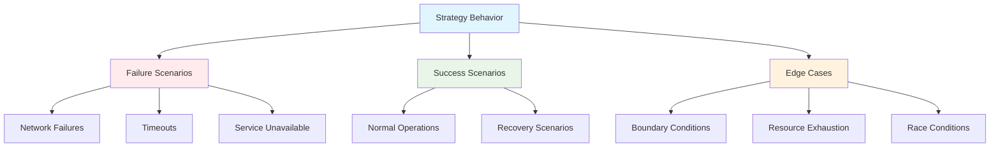

# Testing Resilience Strategies

Testing resilience strategies is crucial for ensuring your applications behave correctly under failure conditions. This comprehensive guide covers testing approaches from unit tests to chaos engineering.

## Testing Philosophy

Resilience testing should validate:



## Unit Testing Strategies

### Testing Retry Strategy
```dart
import 'package:test/test.dart';
import 'package:mockito/mockito.dart';
import 'package:polly_dart/polly_dart.dart';

class MockOperation extends Mock {
  Future<String> call(ResilienceContext context);
}

void main() {
  group('RetryStrategy Tests', () {
    late RetryStrategy<String> retryStrategy;
    late MockOperation mockOperation;

    setUp(() {
      mockOperation = MockOperation();
      retryStrategy = RetryStrategy(RetryStrategyOptions(
        maxRetryAttempts: 3,
        delay: Duration(milliseconds: 100),
        backoffType: DelayBackoffType.exponential,
      ));
    });

    test('should succeed on first attempt', () async {
      // Arrange
      when(mockOperation.call(any)).thenAnswer((_) async => 'success');

      // Act
      final result = await retryStrategy.execute(
        mockOperation.call,
        ResilienceContext(),
      );

      // Assert
      expect(result, equals('success'));
      verify(mockOperation.call(any)).called(1);
    });

    test('should retry on failure and eventually succeed', () async {
      // Arrange
      when(mockOperation.call(any))
          .thenThrow(Exception('Network error'))
          .thenThrow(Exception('Server error'))
          .thenAnswer((_) async => 'success');

      // Act
      final result = await retryStrategy.execute(
        mockOperation.call,
        ResilienceContext(),
      );

      // Assert
      expect(result, equals('success'));
      verify(mockOperation.call(any)).called(3);
    });

    test('should fail after max retry attempts', () async {
      // Arrange
      when(mockOperation.call(any)).thenThrow(Exception('Persistent error'));

      // Act & Assert
      expect(
        () => retryStrategy.execute(mockOperation.call, ResilienceContext()),
        throwsA(isA<Exception>()),
      );
      verify(mockOperation.call(any)).called(4); // Initial + 3 retries
    });

    test('should apply exponential backoff', () async {
      // Arrange
      final stopwatch = Stopwatch()..start();
      when(mockOperation.call(any)).thenThrow(Exception('Error'));

      // Act
      try {
        await retryStrategy.execute(mockOperation.call, ResilienceContext());
      } catch (e) {
        // Expected to fail
      }

      // Assert
      stopwatch.stop();
      // 100ms + 200ms + 400ms = 700ms minimum
      expect(stopwatch.elapsedMilliseconds, greaterThan(600));
    });

    test('should call onRetry callback', () async {
      // Arrange
      var callbackInvoked = false;
      var lastAttemptNumber = 0;
      
      final strategyWithCallback = RetryStrategy(RetryStrategyOptions(
        maxRetryAttempts: 2,
        onRetry: (args) async {
          callbackInvoked = true;
          lastAttemptNumber = args.attemptNumber;
        },
      ));

      when(mockOperation.call(any))
          .thenThrow(Exception('Error'))
          .thenAnswer((_) async => 'success');

      // Act
      await strategyWithCallback.execute(mockOperation.call, ResilienceContext());

      // Assert
      expect(callbackInvoked, isTrue);
      expect(lastAttemptNumber, equals(1));
    });
  });
}
```

### Testing Circuit Breaker Strategy
```dart
void main() {
  group('CircuitBreakerStrategy Tests', () {
    late CircuitBreakerStrategy<String> circuitBreaker;
    late MockOperation mockOperation;

    setUp(() {
      mockOperation = MockOperation();
      circuitBreaker = CircuitBreakerStrategy(CircuitBreakerStrategyOptions(
        failureRatio: 0.5, // 50%
        minimumThroughput: 3,
        durationOfBreak: Duration(seconds: 1),
        samplingDuration: Duration(seconds: 30),
      ));
    });

    test('should remain closed with successful operations', () async {
      // Arrange
      when(mockOperation.call(any)).thenAnswer((_) async => 'success');

      // Act
      for (int i = 0; i < 5; i++) {
        await circuitBreaker.execute(mockOperation.call, ResilienceContext());
      }

      // Assert
      expect(circuitBreaker.state, equals(CircuitBreakerState.closed));
    });

    test('should open circuit after failure threshold reached', () async {
      // Arrange
      when(mockOperation.call(any))
          .thenThrow(Exception('Error'))
          .thenThrow(Exception('Error'))
          .thenThrow(Exception('Error'));

      // Act
      for (int i = 0; i < 3; i++) {
        try {
          await circuitBreaker.execute(mockOperation.call, ResilienceContext());
        } catch (e) {
          // Expected failures
        }
      }

      // Assert
      expect(circuitBreaker.state, equals(CircuitBreakerState.open));
    });

    test('should reject fast when circuit is open', () async {
      // Arrange - Force circuit to open
      when(mockOperation.call(any)).thenThrow(Exception('Error'));
      
      for (int i = 0; i < 3; i++) {
        try {
          await circuitBreaker.execute(mockOperation.call, ResilienceContext());
        } catch (e) {}
      }

      reset(mockOperation); // Clear previous interactions

      // Act & Assert
      expect(
        () => circuitBreaker.execute(mockOperation.call, ResilienceContext()),
        throwsA(isA<CircuitBreakerOpenException>()),
      );
      
      // Verify operation was not called (fast rejection)
      verifyNever(mockOperation.call(any));
    });

    test('should transition to half-open after duration of break', () async {
      // Arrange - Force circuit to open
      when(mockOperation.call(any)).thenThrow(Exception('Error'));
      
      for (int i = 0; i < 3; i++) {
        try {
          await circuitBreaker.execute(mockOperation.call, ResilienceContext());
        } catch (e) {}
      }

      expect(circuitBreaker.state, equals(CircuitBreakerState.open));

      // Act - Wait for duration of break
      await Future.delayed(Duration(milliseconds: 1100));

      // The next call should transition to half-open
      reset(mockOperation);
      when(mockOperation.call(any)).thenAnswer((_) async => 'success');

      await circuitBreaker.execute(mockOperation.call, ResilienceContext());

      // Assert
      expect(circuitBreaker.state, equals(CircuitBreakerState.closed));
    });

    test('should call state change callbacks', () async {
      // Arrange
      var openedCalled = false;
      var halfOpenedCalled = false;
      var closedCalled = false;

      final circuitBreakerWithCallbacks = CircuitBreakerStrategy(
        CircuitBreakerStrategyOptions(
          failureRatio: 0.5,
          minimumThroughput: 2,
          onOpened: (args) async {
            openedCalled = true;
          },
          onHalfOpened: (args) async {
            halfOpenedCalled = true;
          },
          onClosed: (args) async {
            closedCalled = true;
          },
        ),
      );

      when(mockOperation.call(any)).thenThrow(Exception('Error'));

      // Act
      for (int i = 0; i < 2; i++) {
        try {
          await circuitBreakerWithCallback.execute(mockOperation.call, ResilienceContext());
        } catch (e) {}
      }

      // Assert
      expect(stateChangeCalled, isTrue);
      expect(lastNewState, equals(CircuitBreakerState.open));
    });
  });
}
```

### Testing Timeout Strategy
```dart
void main() {
  group('TimeoutStrategy Tests', () {
    late TimeoutStrategy<String> timeoutStrategy;
    late MockOperation mockOperation;

    setUp(() {
      mockOperation = MockOperation();
      timeoutStrategy = TimeoutStrategy(Duration(milliseconds: 500));
    });

    test('should complete successfully within timeout', () async {
      // Arrange
      when(mockOperation.call(any)).thenAnswer((_) async {
        await Future.delayed(Duration(milliseconds: 200));
        return 'success';
      });

      // Act
      final result = await timeoutStrategy.execute(
        mockOperation.call,
        ResilienceContext(),
      );

      // Assert
      expect(result, equals('success'));
    });

    test('should throw TimeoutException when operation exceeds timeout', () async {
      // Arrange
      when(mockOperation.call(any)).thenAnswer((_) async {
        await Future.delayed(Duration(milliseconds: 800));
        return 'success';
      });

      // Act & Assert
      expect(
        () => timeoutStrategy.execute(mockOperation.call, ResilienceContext()),
        throwsA(isA<TimeoutException>()),
      );
    });

    test('should measure timeout duration accurately', () async {
      // Arrange
      final stopwatch = Stopwatch()..start();
      when(mockOperation.call(any)).thenAnswer((_) async {
        await Future.delayed(Duration(seconds: 2));
        return 'success';
      });

      // Act
      try {
        await timeoutStrategy.execute(mockOperation.call, ResilienceContext());
      } catch (e) {
        // Expected timeout
      }

      // Assert
      stopwatch.stop();
      expect(stopwatch.elapsedMilliseconds, lessThan(600)); // Should timeout around 500ms
    });
  });
}
```

### Testing Strategy Combinations
```dart
void main() {
  group('Strategy Combination Tests', () {
    test('should apply retry then circuit breaker', () async {
      // Arrange
      final mockOperation = MockOperation();
      final pipeline = ResiliencePipelineBuilder()
          .addRetry(RetryStrategyOptions(maxRetryAttempts: 2))
          .addCircuitBreaker(CircuitBreakerStrategyOptions(
            failureRatio: 0.5,
            minimumThroughput: 2,
          ))
          .build();

      when(mockOperation.call(any)).thenThrow(Exception('Persistent error'));

      // Act & Assert
      // First execution should retry 3 times (initial + 2 retries)
      try {
        await pipeline.execute(mockOperation.call, ResilienceContext());
      } catch (e) {}

      verify(mockOperation.call(any)).called(3);

      // Second execution should also retry
      reset(mockOperation);
      when(mockOperation.call(any)).thenThrow(Exception('Still failing'));

      try {
        await pipeline.execute(mockOperation.call, ResilienceContext());
      } catch (e) {}

      verify(mockOperation.call(any)).called(3);

      // Circuit should now be open for subsequent calls
      reset(mockOperation);
      expect(
        () => pipeline.execute(mockOperation.call, ResilienceContext()),
        throwsA(isA<CircuitBreakerOpenException>()),
      );
      verifyNever(mockOperation.call(any));
    });

    test('should apply timeout before retry', () async {
      // Arrange
      final mockOperation = MockOperation();
      final pipeline = ResiliencePipelineBuilder()
          .addTimeout(Duration(milliseconds: 200))
          .addRetry(RetryStrategyOptions(maxRetryAttempts: 2))
          .build();

      when(mockOperation.call(any)).thenAnswer((_) async {
        await Future.delayed(Duration(milliseconds: 300));
        return 'success';
      });

      // Act & Assert
      expect(
        () => pipeline.execute(mockOperation.call, ResilienceContext()),
        throwsA(isA<TimeoutException>()),
      );
      
      // Should be called 3 times due to retry, but each should timeout
      verify(mockOperation.call(any)).called(3);
    });
  });
}
```

## Integration Testing

### Testing with Real Dependencies
```dart
void main() {
  group('Integration Tests', () {
    late HttpClient httpClient;
    late ResiliencePipeline pipeline;

    setUp(() {
      httpClient = HttpClient();
      pipeline = ResiliencePipelineBuilder()
          .addRetry(RetryStrategyOptions(maxRetryAttempts: 2))
          .addCircuitBreaker(CircuitBreakerStrategyOptions(
            failureRatio: 0.5,
            minimumThroughput: 3,
          ))
          .addTimeout(Duration(seconds: 5))
          .build();
    });

    tearDown(() {
      httpClient.close();
    });

    test('should handle real HTTP failures gracefully', () async {
      // Test against a service that returns errors
      final result = await pipeline.execute((context) async {
        final request = await httpClient.getUrl(Uri.parse('https://httpstat.us/500'));
        final response = await request.close();
        
        if (response.statusCode != 200) {
          throw HttpException('HTTP ${response.statusCode}');
        }
        
        return await response.transform(utf8.decoder).join();
      });

      // Should eventually fail after retries
      expect(() => result, throwsA(isA<HttpException>()));
    });

    test('should handle network timeouts', () async {
      // Test against a slow endpoint
      expect(
        () => pipeline.execute((context) async {
          final request = await httpClient.getUrl(Uri.parse('https://httpstat.us/200?sleep=10000'));
          final response = await request.close();
          return await response.transform(utf8.decoder).join();
        }),
        throwsA(isA<TimeoutException>()),
      );
    });
  });
}
```

### Database Integration Testing
```dart
void main() {
  group('Database Integration Tests', () {
    late DatabaseConnection database;
    late ResiliencePipeline pipeline;

    setUp(() async {
      database = await DatabaseConnection.connect('test_db');
      pipeline = ResiliencePipelineBuilder()
          .addRetry(RetryStrategyOptions(
            maxRetryAttempts: 3,
            shouldHandle: (outcome) => outcome.hasException &&
                (outcome.exception is DatabaseException || 
                 outcome.exception is ConnectionException),
          ))
          .addCircuitBreaker(CircuitBreakerStrategyOptions(
            failureRatio: 0.6,
            minimumThroughput: 5,
          ))
          .build();
    });

    tearDown(() async {
      await database.close();
    });

    test('should retry database connection failures', () async {
      // Simulate connection drops during operation
      var attemptCount = 0;
      
      final result = await pipeline.execute((context) async {
        attemptCount++;
        
        if (attemptCount < 3) {
          throw ConnectionException('Connection lost');
        }
        
        return await database.query('SELECT * FROM users WHERE id = ?', [123]);
      });

      expect(result, isNotNull);
      expect(attemptCount, equals(3));
    });

    test('should handle database deadlocks', () async {
      // Test transaction retry on deadlock
      await pipeline.execute((context) async {
        return await database.transaction((txn) async {
          await txn.execute('UPDATE accounts SET balance = balance - 100 WHERE id = 1');
          await txn.execute('UPDATE accounts SET balance = balance + 100 WHERE id = 2');
        });
      });
    });
  });
}
```

## Load Testing

### Performance Testing Framework
```dart
class LoadTestRunner {
  final ResiliencePipeline pipeline;
  final int concurrentUsers;
  final Duration testDuration;
  final Future<String> Function() operation;

  LoadTestRunner({
    required this.pipeline,
    required this.concurrentUsers,
    required this.testDuration,
    required this.operation,
  });

  Future<LoadTestResults> run() async {
    final results = LoadTestResults();
    final futures = <Future<void>>[];

    final endTime = DateTime.now().add(testDuration);

    // Start concurrent users
    for (int i = 0; i < concurrentUsers; i++) {
      futures.add(_runUser(i, endTime, results));
    }

    await Future.wait(futures);
    return results;
  }

  Future<void> _runUser(int userId, DateTime endTime, LoadTestResults results) async {
    while (DateTime.now().isBefore(endTime)) {
      final stopwatch = Stopwatch()..start();
      
      try {
        await pipeline.execute((context) async {
          context.setProperty('user_id', userId);
          return await operation();
        });
        
        stopwatch.stop();
        results.recordSuccess(stopwatch.elapsed);
      } catch (e) {
        stopwatch.stop();
        results.recordFailure(stopwatch.elapsed, e);
      }

      // Small delay to prevent overwhelming
      await Future.delayed(Duration(milliseconds: 10));
    }
  }
}

class LoadTestResults {
  final List<Duration> successTimes = [];
  final List<Duration> failureTimes = [];
  final Map<String, int> errorCounts = {};

  void recordSuccess(Duration duration) {
    successTimes.add(duration);
  }

  void recordFailure(Duration duration, Object error) {
    failureTimes.add(duration);
    final errorType = error.runtimeType.toString();
    errorCounts[errorType] = (errorCounts[errorType] ?? 0) + 1;
  }

  double get successRate => successTimes.length / (successTimes.length + failureTimes.length);
  
  Duration get averageSuccessTime => successTimes.isEmpty 
      ? Duration.zero 
      : Duration(microseconds: successTimes.map((d) => d.inMicroseconds).reduce((a, b) => a + b) ~/ successTimes.length);
      
  Duration get p95SuccessTime {
    if (successTimes.isEmpty) return Duration.zero;
    final sorted = List<Duration>.from(successTimes)..sort((a, b) => a.compareTo(b));
    final index = (sorted.length * 0.95).round() - 1;
    return sorted[index.clamp(0, sorted.length - 1)];
  }

  void printSummary() {
    print('Load Test Results:');
    print('Success Rate: ${(successRate * 100).toStringAsFixed(2)}%');
    print('Total Requests: ${successTimes.length + failureTimes.length}');
    print('Successful Requests: ${successTimes.length}');
    print('Failed Requests: ${failureTimes.length}');
    print('Average Response Time: ${averageSuccessTime.inMilliseconds}ms');
    print('95th Percentile Response Time: ${p95SuccessTime.inMilliseconds}ms');
    print('\nError Breakdown:');
    errorCounts.forEach((error, count) {
      print('  $error: $count');
    });
  }
}

// Example load test
void main() async {
  final pipeline = ResiliencePipelineBuilder()
      .addRetry(RetryStrategyOptions(maxRetryAttempts: 2))
      .addCircuitBreaker(CircuitBreakerStrategyOptions(
        failureRatio: 0.5,
        minimumThroughput: 10,
      ))
      .addTimeout(Duration(seconds: 5))
      .build();

  final loadTest = LoadTestRunner(
    pipeline: pipeline,
    concurrentUsers: 50,
    testDuration: Duration(minutes: 5),
    operation: () async {
      // Simulate API call
      await Future.delayed(Duration(milliseconds: Random().nextInt(1000)));
      if (Random().nextDouble() < 0.1) {
        throw Exception('Random failure');
      }
      return 'success';
    },
  );

  print('Starting load test...');
  final results = await loadTest.run();
  results.printSummary();
}
```

## Chaos Engineering

### Fault Injection Framework
```dart
class FaultInjector {
  final double failureRate;
  final Duration? latencyMin;
  final Duration? latencyMax;
  final List<Exception> possibleExceptions;

  FaultInjector({
    this.failureRate = 0.1,
    this.latencyMin,
    this.latencyMax,
    this.possibleExceptions = const [],
  });

  Future<T> inject<T>(Future<T> Function() operation) async {
    final random = Random();

    // Inject latency
    if (latencyMin != null && latencyMax != null) {
      final latency = Duration(
        milliseconds: latencyMin!.inMilliseconds + 
        random.nextInt(latencyMax!.inMilliseconds - latencyMin!.inMilliseconds),
      );
      await Future.delayed(latency);
    }

    // Inject failures
    if (random.nextDouble() < failureRate) {
      if (possibleExceptions.isNotEmpty) {
        throw possibleExceptions[random.nextInt(possibleExceptions.length)];
      } else {
        throw Exception('Injected fault');
      }
    }

    return await operation();
  }
}

class ChaosTestRunner {
  final ResiliencePipeline pipeline;
  final FaultInjector faultInjector;

  ChaosTestRunner(this.pipeline, this.faultInjector);

  Future<ChaosTestResults> runChaosTest({
    required Duration duration,
    required int concurrency,
    required Future<String> Function() baseOperation,
  }) async {
    final results = ChaosTestResults();
    final futures = <Future<void>>[];
    final endTime = DateTime.now().add(duration);

    for (int i = 0; i < concurrency; i++) {
      futures.add(_runChaosWorker(i, endTime, baseOperation, results));
    }

    await Future.wait(futures);
    return results;
  }

  Future<void> _runChaosWorker(
    int workerId,
    DateTime endTime,
    Future<String> Function() baseOperation,
    ChaosTestResults results,
  ) async {
    while (DateTime.now().isBefore(endTime)) {
      final stopwatch = Stopwatch()..start();

      try {
        await pipeline.execute((context) async {
          context.setProperty('worker_id', workerId);
          
          // Inject faults into the operation
          return await faultInjector.inject(() async {
            return await baseOperation();
          });
        });

        stopwatch.stop();
        results.recordSuccess(stopwatch.elapsed);
      } catch (e) {
        stopwatch.stop();
        results.recordFailure(e, stopwatch.elapsed);
      }

      await Future.delayed(Duration(milliseconds: 50));
    }
  }
}

class ChaosTestResults {
  final List<Duration> successDurations = [];
  final Map<String, List<Duration>> failureDurations = {};
  int totalRequests = 0;

  void recordSuccess(Duration duration) {
    successDurations.add(duration);
    totalRequests++;
  }

  void recordFailure(Object error, Duration duration) {
    final errorType = error.runtimeType.toString();
    failureDurations.putIfAbsent(errorType, () => []).add(duration);
    totalRequests++;
  }

  double get resilienceScore {
    // Calculate a resilience score based on success rate and recovery time
    final successRate = successDurations.length / totalRequests;
    final avgRecoveryTime = _calculateAverageRecoveryTime();
    
    // Score formula: success_rate * (1 - normalized_recovery_time)
    final normalizedRecoveryTime = (avgRecoveryTime.inMilliseconds / 5000.0).clamp(0.0, 1.0);
    return successRate * (1 - normalizedRecoveryTime);
  }

  Duration _calculateAverageRecoveryTime() {
    if (successDurations.isEmpty) return Duration(seconds: 5);
    
    final totalMs = successDurations
        .map((d) => d.inMilliseconds)
        .reduce((a, b) => a + b);
    
    return Duration(milliseconds: totalMs ~/ successDurations.length);
  }

  void printDetailedReport() {
    print('=== Chaos Engineering Test Results ===');
    print('Total Requests: $totalRequests');
    print('Successful Requests: ${successDurations.length}');
    print('Success Rate: ${(successDurations.length / totalRequests * 100).toStringAsFixed(2)}%');
    print('Resilience Score: ${(resilienceScore * 100).toStringAsFixed(2)}/100');
    print('\nFailure Breakdown:');
    failureDurations.forEach((errorType, durations) {
      print('  $errorType: ${durations.length} occurrences');
      if (durations.isNotEmpty) {
        final avgDuration = Duration(
          milliseconds: durations.map((d) => d.inMilliseconds).reduce((a, b) => a + b) ~/ durations.length
        );
        print('    Average duration: ${avgDuration.inMilliseconds}ms');
      }
    });
  }
}

// Example chaos test
void main() async {
  final pipeline = ResiliencePipelineBuilder()
      .addRetry(RetryStrategyOptions(maxRetryAttempts: 3))
      .addCircuitBreaker(CircuitBreakerStrategyOptions(
        failureRatio: 0.6,
        minimumThroughput: 5,
      ))
      .addTimeout(Duration(seconds: 10))
      .build();

  final faultInjector = FaultInjector(
    failureRate: 0.3, // 30% failure rate
    latencyMin: Duration(milliseconds: 100),
    latencyMax: Duration(milliseconds: 2000),
    possibleExceptions: [
      HttpException('Service unavailable'),
      TimeoutException('Request timeout'),
      Exception('Network error'),
    ],
  );

  final chaosRunner = ChaosTestRunner(pipeline, faultInjector);

  print('Starting chaos engineering test...');
  final results = await chaosRunner.runChaosTest(
    duration: Duration(minutes: 3),
    concurrency: 20,
    baseOperation: () async {
      // Simulate a real operation
      await Future.delayed(Duration(milliseconds: 200));
      return 'operation_result';
    },
  );

  results.printDetailedReport();
}
```

## Test Utilities

### Mock Strategy Factory
```dart
class MockStrategyFactory {
  static ResilienceStrategy<T> createFailingRetry<T>({int failTimes = 2}) {
    return MockRetryStrategy<T>(failTimes);
  }

  static ResilienceStrategy<T> createSlowTimeout<T>({Duration delay = const Duration(seconds: 2)}) {
    return MockTimeoutStrategy<T>(delay);
  }

  static ResilienceStrategy<T> createOpenCircuitBreaker<T>() {
    return MockCircuitBreakerStrategy<T>(CircuitBreakerState.open);
  }
}

class MockRetryStrategy<T> implements ResilienceStrategy<T> {
  final int failTimes;
  int currentAttempt = 0;

  MockRetryStrategy(this.failTimes);

  @override
  Future<T> execute<T>(
    Future<T> Function(ResilienceContext context) operation,
    ResilienceContext context,
  ) async {
    currentAttempt++;
    
    if (currentAttempt <= failTimes) {
      throw Exception('Mock failure ${currentAttempt}');
    }
    
    return await operation(context);
  }
}

class MockTimeoutStrategy<T> implements ResilienceStrategy<T> {
  final Duration delay;

  MockTimeoutStrategy(this.delay);

  @override
  Future<T> execute<T>(
    Future<T> Function(ResilienceContext context) operation,
    ResilienceContext context,
  ) async {
    await Future.delayed(delay);
    throw TimeoutException('Mock timeout');
  }
}

class MockCircuitBreakerStrategy<T> implements ResilienceStrategy<T> {
  final CircuitBreakerState state;

  MockCircuitBreakerStrategy(this.state);

  @override
  Future<T> execute<T>(
    Future<T> Function(ResilienceContext context) operation,
    ResilienceContext context,
  ) async {
    if (state == CircuitBreakerState.open) {
      throw CircuitBreakerOpenException('Mock circuit breaker is open');
    }
    
    return await operation(context);
  }
}
```

### Test Data Builders
```dart
class ResilienceContextBuilder {
  final Map<String, dynamic> _properties = {};

  ResilienceContextBuilder withProperty(String key, dynamic value) {
    _properties[key] = value;
    return this;
  }

  ResilienceContextBuilder withOperationName(String name) {
    return withProperty('operation_name', name);
  }

  ResilienceContextBuilder withCorrelationId(String id) {
    return withProperty('correlation_id', id);
  }

  ResilienceContext build() {
    final context = ResilienceContext();
    _properties.forEach((key, value) {
      context.setProperty(key, value);
    });
    return context;
  }
}

class RetryOptionsBuilder {
  int _maxAttempts = 3;
  Duration _delay = Duration(milliseconds: 100);
  DelayBackoffType _backoffType = DelayBackoffType.exponential;
  List<Type> _handledExceptions = [];

  RetryOptionsBuilder withMaxAttempts(int attempts) {
    _maxAttempts = attempts;
    return this;
  }

  RetryOptionsBuilder withDelay(Duration delay) {
    _delay = delay;
    return this;
  }

  RetryOptionsBuilder withBackoffType(DelayBackoffType type) {
    _backoffType = type;
    return this;
  }

  RetryOptionsBuilder handling<T extends Exception>() {
    _handledExceptions.add(T);
    return this;
  }

  RetryStrategyOptions build() {
    return RetryStrategyOptions(
      maxRetryAttempts: _maxAttempts,
      delay: _delay,
      backoffType: _backoffType,
      shouldHandle: (outcome) => outcome.hasException &&
          _handledExceptions.any((type) => type == outcome.exception.runtimeType),
    );
  }
}

// Usage in tests
void main() {
  test('should use test builders', () async {
    final context = ResilienceContextBuilder()
        .withOperationName('test_operation')
        .withCorrelationId('test-123')
        .build();

    final retryOptions = RetryOptionsBuilder()
        .withMaxAttempts(5)
        .withDelay(Duration(milliseconds: 50))
        .withBackoff(1.5)
        .handling<HttpException>()
        .build();

    final strategy = RetryStrategy(retryOptions);
    
    // Test with built objects
    expect(context.getProperty('operation_name'), equals('test_operation'));
    expect(retryOptions.maxRetryAttempts, equals(5));
  });
}
```

## Best Practices

### ✅ **Do**

**Test Edge Cases**
```dart
test('should handle null and empty inputs gracefully', () async {
  final strategy = RetryStrategy(RetryStrategyOptions(maxRetryAttempts: 1));
  
  // Test with null context
  expect(
    () => strategy.execute((ctx) async => 'result', null),
    throwsArgumentError,
  );
});
```

**Use Time Control in Tests**
```dart
test('should respect timing with fake async', () async {
  await fakeAsync((async) {
    var completed = false;
    
    final future = timeoutStrategy.execute((context) async {
      async.elapse(Duration(seconds: 2));
      completed = true;
      return 'result';
    }, ResilienceContext());

    async.elapse(Duration(seconds: 1));
    expect(completed, isFalse);
    
    expect(() => future, throwsA(isA<TimeoutException>()));
  });
});
```

**Test Strategy Interactions**
```dart
test('should verify strategy execution order', () async {
  final executionOrder = <String>[];
  
  final pipeline = ResiliencePipelineBuilder()
      .addStrategy(RecordingStrategy('timeout', executionOrder))
      .addStrategy(RecordingStrategy('retry', executionOrder))
      .addStrategy(RecordingStrategy('circuit-breaker', executionOrder))
      .build();

  await pipeline.execute((context) async => 'result');
  
  expect(executionOrder, equals(['timeout', 'retry', 'circuit-breaker']));
});
```

### ❌ **Don't**

**Don't Test Implementation Details**
```dart
// ❌ Bad: Testing internal state
test('should have internal counter set to 3', () {
  expect(strategy._internalCounter, equals(3));
});

// ✅ Good: Testing behavior
test('should retry 3 times before failing', () {
  verify(mockOperation.call(any)).called(4); // Initial + 3 retries
});
```

**Don't Use Real External Dependencies in Unit Tests**
```dart
// ❌ Bad: Real HTTP calls in unit tests
test('should retry HTTP failures', () async {
  final result = await strategy.execute(() async {
    return await http.get('https://api.example.com/users');
  });
});

// ✅ Good: Mock external dependencies
test('should retry HTTP failures', () async {
  when(mockHttpClient.get(any)).thenThrow(HttpException('Server error'));
  
  expect(
    () => strategy.execute(() => mockHttpClient.get('test')),
    throwsA(isA<HttpException>()),
  );
});
```

## Continuous Testing

### Automated Test Pipeline
```yaml
# .github/workflows/test.yml
name: Test Suite

on: [push, pull_request]

jobs:
  unit-tests:
    runs-on: ubuntu-latest
    steps:
      - uses: actions/checkout@v2
      - uses: dart-lang/setup-dart@v1
      - run: dart pub get
      - run: dart test test/unit/
      
  integration-tests:
    runs-on: ubuntu-latest
    services:
      redis:
        image: redis:6
        ports:
          - 6379:6379
    steps:
      - uses: actions/checkout@v2
      - uses: dart-lang/setup-dart@v1
      - run: dart pub get
      - run: dart test test/integration/
      
  load-tests:
    runs-on: ubuntu-latest
    if: github.ref == 'refs/heads/main'
    steps:
      - uses: actions/checkout@v2
      - uses: dart-lang/setup-dart@v1
      - run: dart pub get
      - run: dart run test/load/load_test.dart
      
  chaos-tests:
    runs-on: ubuntu-latest
    if: github.event_name == 'schedule'  # Weekly chaos tests
    steps:
      - uses: actions/checkout@v2
      - uses: dart-lang/setup-dart@v1
      - run: dart pub get
      - run: dart run test/chaos/chaos_test.dart
```

## Test Coverage and Reporting

```dart
// coverage_reporter.dart
import 'dart:io';

void main() async {
  // Run tests with coverage
  final result = await Process.run('dart', [
    'test',
    '--coverage=coverage',
    '--reporter=json',
  ]);

  if (result.exitCode != 0) {
    print('Tests failed: ${result.stderr}');
    exit(1);
  }

  // Generate coverage report
  await Process.run('genhtml', [
    'coverage/lcov.info',
    '-o',
    'coverage/html',
  ]);

  // Check coverage threshold
  final coverageData = File('coverage/lcov.info').readAsStringSync();
  final linesCovered = RegExp(r'LH:(\d+)').allMatches(coverageData)
      .map((m) => int.parse(m.group(1)!))
      .reduce((a, b) => a + b);
      
  final linesTotal = RegExp(r'LF:(\d+)').allMatches(coverageData)
      .map((m) => int.parse(m.group(1)!))
      .reduce((a, b) => a + b);

  final coveragePercentage = (linesCovered / linesTotal) * 100;
  
  print('Coverage: ${coveragePercentage.toStringAsFixed(2)}%');
  
  if (coveragePercentage < 80.0) {
    print('Coverage below threshold (80%)');
    exit(1);
  }
}
```

Testing resilience strategies thoroughly ensures your applications remain robust under all conditions! 🧪

## Next Steps

- **[Explore Real Examples](../examples/)** - See complete applications with tests
- **[Review API Reference](../api/)** - Understand testing integration points
- **[Learn Monitoring](./monitoring)** - Combine testing with observability
