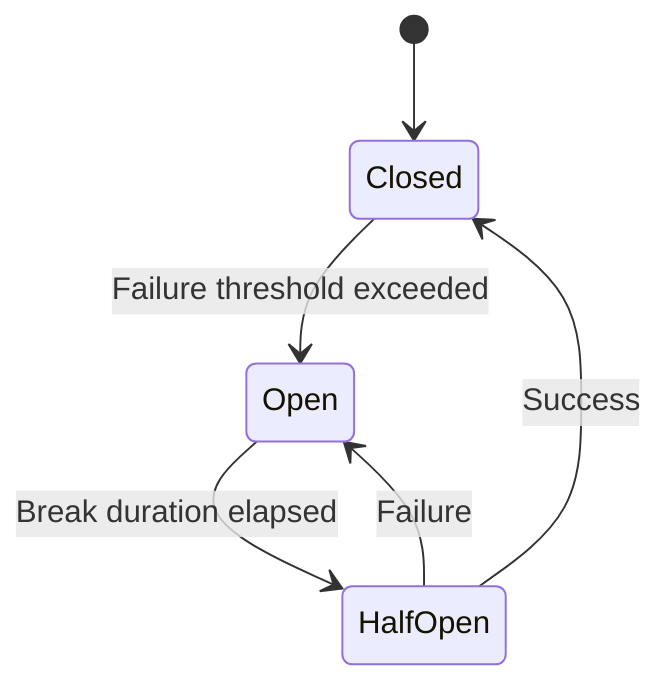

# Circuit Breaker Strategy

The **Circuit Breaker Strategy** protects your application from cascading failures by monitoring the health of external dependencies and temporarily blocking calls when they're failing. Like an electrical circuit breaker, it "opens" to stop the flow when problems are detected.

## The Circuit Breaker Pattern



### Circuit States

- **🟢 Closed**: Normal operation, calls are allowed through
- **🔴 Open**: Failure threshold exceeded, calls are blocked immediately  
- **🟡 Half-Open**: Testing if the service has recovered, allows limited calls

## When to Use Circuit Breaker

Circuit breakers are essential for:

- 🛡️ **Preventing cascading failures** when downstream services fail
- ⚡ **Fast-failing** instead of waiting for timeouts
- 🔄 **Giving failing services time** to recover
- 📊 **Monitoring service health** and failure patterns
- 🚀 **Improving user experience** with quick error responses

:::tip Perfect with Retry
Circuit breakers work excellently with retry strategies. Place retry inside the circuit breaker to retry individual attempts, or outside to retry the entire circuit breaker decision.
:::

## Basic Usage

### Simple Circuit Breaker
```dart
import 'package:polly_dart/polly_dart.dart';

final pipeline = ResiliencePipelineBuilder()
    .addCircuitBreaker()  // Default: 50% failure rate, 30s sampling, 5s break
    .build();

final result = await pipeline.execute((context) async {
  return await externalServiceCall();
});
```

### Configured Circuit Breaker
```dart
final pipeline = ResiliencePipelineBuilder()
    .addCircuitBreaker(CircuitBreakerStrategyOptions(
      failureRatio: 0.6,                    // 60% failure rate to open
      samplingDuration: Duration(minutes: 1), // Calculate ratio over 1 minute
      minimumThroughput: 20,                 // Need 20 calls before opening
      breakDuration: Duration(minutes: 2),   // Stay open for 2 minutes
    ))
    .build();
```

## Configuration Options

### CircuitBreakerStrategyOptions

| Property | Type | Default | Description |
|----------|------|---------|-------------|
| `failureRatio` | `double` | `0.5` | Failure ratio (0.0-1.0) that triggers the circuit to open |
| `samplingDuration` | `Duration` | `30 seconds` | Time window for calculating failure ratio |
| `minimumThroughput` | `int` | `10` | Minimum requests before circuit can open |
| `breakDuration` | `Duration` | `5 seconds` | Duration circuit stays open |
| `breakDurationGenerator` | `BreakDurationGenerator<T>?` | `null` | Dynamic break duration calculation |
| `shouldHandle` | `ShouldHandlePredicate<T>?` | `null` | Predicate to determine what counts as failure |
| `stateProvider` | `CircuitBreakerStateProvider?` | `null` | Custom state management |
| `manualControl` | `CircuitBreakerManualControl?` | `null` | Manual circuit control |
| `onOpened` | `OnCircuitOpened<T>?` | `null` | Callback when circuit opens |
| `onClosed` | `OnCircuitClosed<T>?` | `null` | Callback when circuit closes |
| `onHalfOpened` | `OnCircuitHalfOpened<T>?` | `null` | Callback when circuit goes half-open |

## Circuit Breaker Behavior

### Failure Ratio Calculation
The circuit breaker tracks requests over a sliding time window:

```dart
final circuitBreaker = ResiliencePipelineBuilder()
    .addCircuitBreaker(CircuitBreakerStrategyOptions(
      failureRatio: 0.5,                    // 50% failure threshold
      samplingDuration: Duration(seconds: 30), // Over 30-second window
      minimumThroughput: 10,                 // Need at least 10 requests
    ))
    .build();

// If in the last 30 seconds:
// - 15 requests were made (≥ minimum throughput)
// - 8 failed (8/15 = 53% > 50% threshold)
// → Circuit opens
```

### Break Duration
When the circuit opens, it blocks all requests for the break duration:

```dart
final circuitBreaker = ResiliencePipelineBuilder()
    .addCircuitBreaker(CircuitBreakerStrategyOptions(
      breakDuration: Duration(minutes: 2),
    ))
    .build();

// When circuit opens:
// t=0: Circuit opens, all calls throw CircuitBreakerOpenException
// t=2min: Circuit goes to half-open, allows one test call
```

### Dynamic Break Duration
Implement progressive break durations that increase with consecutive failures:

```dart
final adaptiveCircuitBreaker = ResiliencePipelineBuilder()
    .addCircuitBreaker(CircuitBreakerStrategyOptions(
      breakDurationGenerator: (args) async {
        final failureCount = args.failureCount;
        
        // Progressive backoff: 5s, 10s, 30s, 1min, 5min
        switch (failureCount) {
          case 1: return Duration(seconds: 5);
          case 2: return Duration(seconds: 10);
          case 3: return Duration(seconds: 30);
          case 4: return Duration(minutes: 1);
          default: return Duration(minutes: 5);
        }
      },
    ))
    .build();
```

## Smart Failure Detection

### Selective Failure Handling
Only count specific failures toward the circuit breaker threshold:

```dart
bool shouldCountAsFailure(Outcome outcome) {
  if (!outcome.hasException) return false;
  
  final exception = outcome.exception;
  
  // Don't count client errors as circuit breaker failures
  if (exception is HttpException) {
    final message = exception.message.toLowerCase();
    // 4xx errors are client issues, not service failures
    if (message.contains('400') || 
        message.contains('401') || 
        message.contains('403') || 
        message.contains('404')) {
      return false;
    }
  }
  
  // Count server errors and network issues
  return exception is HttpException ||
         exception is SocketException ||
         exception is TimeoutException;
}

final smartCircuitBreaker = ResiliencePipelineBuilder()
    .addCircuitBreaker(CircuitBreakerStrategyOptions(
      shouldHandle: shouldCountAsFailure,
      failureRatio: 0.4,
      minimumThroughput: 15,
    ))
    .build();
```

### Business Logic Failures
Handle business logic failures that should trigger the circuit:

```dart
bool isBusinessFailure(Outcome outcome) {
  // Count exceptions as failures
  if (outcome.hasException) return true;
  
  // Check business logic results
  if (outcome.hasResult) {
    final result = outcome.result;
    if (result is ApiResponse) {
      return result.status == 'service_degraded' ||
             result.status == 'rate_limited' ||
             result.errorCode?.startsWith('TEMP_') == true;
    }
  }
  
  return false;
}
```

## State Monitoring and Callbacks

### Circuit State Callbacks
Monitor circuit state changes for alerting and logging:

```dart
final monitoredCircuitBreaker = ResiliencePipelineBuilder()
    .addCircuitBreaker(CircuitBreakerStrategyOptions(
      onOpened: (args) async {
        logger.error('🔴 Circuit breaker opened for ${args.context.operationKey}');
        
        // Send alert
        await alertService.send(
          'Circuit Breaker Opened',
          'Service ${args.context.operationKey} is failing. '
          'Break duration: ${args.breakDuration}',
          severity: AlertSeverity.high,
        );
        
        // Emit metrics
        metrics.incrementCounter('circuit_breaker_opened', tags: {
          'service': args.context.operationKey ?? 'unknown',
        });
      },
      
      onClosed: (args) async {
        logger.info('🟢 Circuit breaker closed for ${args.context.operationKey}');
        
        await alertService.send(
          'Circuit Breaker Closed',
          'Service ${args.context.operationKey} has recovered',
          severity: AlertSeverity.info,
        );
      },
      
      onHalfOpened: (args) async {
        logger.info('🟡 Circuit breaker half-open for ${args.context.operationKey}');
        
        metrics.incrementCounter('circuit_breaker_half_open', tags: {
          'service': args.context.operationKey ?? 'unknown',
        });
      },
    ))
    .build();
```

### Manual Circuit Control
Manually control circuit state for maintenance or emergency situations:

```dart
final manualControl = CircuitBreakerManualControl();

final controlledCircuitBreaker = ResiliencePipelineBuilder()
    .addCircuitBreaker(CircuitBreakerStrategyOptions(
      manualControl: manualControl,
    ))
    .build();

// Manual operations
await manualControl.isolate();  // Force circuit open
await manualControl.close();    // Force circuit closed
await manualControl.reset();    // Reset to automatic mode
```

## Exception Handling

### Circuit Breaker Exceptions
```dart
try {
  final result = await circuitBreakerPipeline.execute((context) async {
    return await externalService.getData();
  });
} on CircuitBreakerOpenException catch (e) {
  // Circuit is open - service is failing
  logger.warning('Service unavailable: ${e.message}');
  return getCachedData(); // Fallback to cached data
} catch (e) {
  // Other failures
  logger.error('Unexpected error: $e');
  rethrow;
}
```

## Real-World Examples

### HTTP Service with Circuit Breaker
```dart
class ResilientApiClient {
  final String _baseUrl;
  final HttpClient _httpClient = HttpClient();
  late final ResiliencePipeline _pipeline;

  ResilientApiClient(this._baseUrl) {
    _pipeline = ResiliencePipelineBuilder()
        .addCircuitBreaker(CircuitBreakerStrategyOptions(
          failureRatio: 0.5,
          samplingDuration: Duration(seconds: 30),
          minimumThroughput: 5,
          breakDuration: Duration(seconds: 30),
          shouldHandle: _isServiceFailure,
          onOpened: _onCircuitOpened,
          onClosed: _onCircuitClosed,
        ))
        .build();
  }

  Future<ApiResponse> get(String endpoint) async {
    try {
      return await _pipeline.execute((context) async {
        context.setProperty('endpoint', endpoint);
        
        final uri = Uri.parse('$_baseUrl$endpoint');
        final request = await _httpClient.getUrl(uri);
        final response = await request.close();
        
        final body = await response.transform(utf8.decoder).join();
        
        if (response.statusCode >= 500) {
          throw HttpException(
            'Server error: ${response.statusCode}',
            uri: uri,
          );
        }
        
        return ApiResponse.fromJson(json.decode(body));
      });
    } on CircuitBreakerOpenException {
      // Return cached data or default response when circuit is open
      return _getCachedResponse(endpoint);
    }
  }

  bool _isServiceFailure(Outcome outcome) {
    if (!outcome.hasException) return false;
    
    final exception = outcome.exception;
    
    // Network and server errors count as service failures
    return exception is SocketException ||
           exception is TimeoutException ||
           (exception is HttpException && 
            exception.message.contains('5')); // 5xx errors
  }

  Future<void> _onCircuitOpened(OnCircuitOpenedArguments args) async {
    final endpoint = args.context.getProperty<String>('endpoint') ?? 'unknown';
    logger.error('Circuit opened for $_baseUrl$endpoint');
    
    // Notify monitoring system
    await monitoringService.reportCircuitOpen(_baseUrl, endpoint);
  }

  Future<void> _onCircuitClosed(OnCircuitClosedArguments args) async {
    final endpoint = args.context.getProperty<String>('endpoint') ?? 'unknown';
    logger.info('Circuit closed for $_baseUrl$endpoint');
    
    await monitoringService.reportCircuitClosed(_baseUrl, endpoint);
  }

  ApiResponse _getCachedResponse(String endpoint) {
    // Return cached data when service is unavailable
    return cacheService.get(endpoint) ?? 
           ApiResponse.error('Service temporarily unavailable');
  }

  void dispose() {
    _httpClient.close();
  }
}
```

### Database Connection Pool with Circuit Breaker
```dart
class ResilientDatabase {
  final ConnectionPool _pool;
  late final ResiliencePipeline _pipeline;

  ResilientDatabase(this._pool) {
    _pipeline = ResiliencePipelineBuilder()
        .addCircuitBreaker(CircuitBreakerStrategyOptions(
          failureRatio: 0.7,                    // Database can handle more failures
          samplingDuration: Duration(minutes: 1),
          minimumThroughput: 10,
          breakDuration: Duration(seconds: 15),  // Shorter break for database
          shouldHandle: _isDatabaseFailure,
        ))
        .build();
  }

  Future<List<Map<String, dynamic>>> query(String sql, [List<dynamic>? params]) async {
    return await _pipeline.execute((context) async {
      final connection = await _pool.getConnection();
      try {
        return await connection.query(sql, params);
      } finally {
        _pool.releaseConnection(connection);
      }
    });
  }

  bool _isDatabaseFailure(Outcome outcome) {
    if (!outcome.hasException) return false;
    
    final exception = outcome.exception;
    final message = exception.toString().toLowerCase();
    
    // Count connection and server issues, not query errors
    return message.contains('connection') ||
           message.contains('timeout') ||
           message.contains('server') ||
           message.contains('unavailable');
  }
}
```

### Microservice Client with Advanced Circuit Breaker
```dart
class MicroserviceClient {
  final String _serviceName;
  final String _baseUrl;
  late final ResiliencePipeline _pipeline;
  int _consecutiveFailures = 0;

  MicroserviceClient(this._serviceName, this._baseUrl) {
    _pipeline = ResiliencePipelineBuilder()
        .addCircuitBreaker(CircuitBreakerStrategyOptions(
          failureRatio: 0.4,
          samplingDuration: Duration(seconds: 45),
          minimumThroughput: 8,
          breakDurationGenerator: _calculateBreakDuration,
          shouldHandle: _shouldCountFailure,
          onOpened: _onCircuitOpened,
          onClosed: _onCircuitClosed,
          onHalfOpened: _onCircuitHalfOpened,
        ))
        .build();
  }

  Future<T> call<T>(String method, String path, T Function(Map<String, dynamic>) parser) async {
    final context = ResilienceContext(operationKey: '$_serviceName.$method');
    
    try {
      return await _pipeline.execute((ctx) async {
        final response = await _makeHttpCall(method, path);
        _consecutiveFailures = 0; // Reset on success
        return parser(response);
      }, context: context);
    } on CircuitBreakerOpenException {
      // Implement service mesh fallback or cached response
      throw ServiceUnavailableException('$_serviceName is currently unavailable');
    }
  }

  Future<Duration> _calculateBreakDuration(BreakDurationGeneratorArguments args) async {
    _consecutiveFailures++;
    
    // Progressive break duration based on consecutive failures
    final baseSeconds = math.min(5 * math.pow(2, _consecutiveFailures - 1), 300); // Max 5 minutes
    return Duration(seconds: baseSeconds.toInt());
  }

  bool _shouldCountFailure(Outcome outcome) {
    if (!outcome.hasException) return false;
    
    final exception = outcome.exception;
    
    // Don't count authentication or authorization failures
    if (exception is HttpException) {
      final message = exception.message;
      if (message.contains('401') || message.contains('403')) {
        return false;
      }
    }
    
    return true;
  }

  Future<void> _onCircuitOpened(OnCircuitOpenedArguments args) async {
    await serviceRegistry.markServiceDown(_serviceName);
    await metrics.recordCircuitOpen(_serviceName);
  }

  Future<void> _onCircuitClosed(OnCircuitClosedArguments args) async {
    _consecutiveFailures = 0;
    await serviceRegistry.markServiceUp(_serviceName);
    await metrics.recordCircuitClose(_serviceName);
  }

  Future<void> _onCircuitHalfOpened(OnCircuitHalfOpenedArguments args) async {
    await metrics.recordCircuitHalfOpen(_serviceName);
  }

  Future<Map<String, dynamic>> _makeHttpCall(String method, String path) async {
    // Implementation details...
    throw UnimplementedError();
  }
}
```

## Testing Circuit Breaker

### Unit Testing Circuit States
```dart
import 'package:test/test.dart';
import 'package:polly_dart/polly_dart.dart';

void main() {
  group('Circuit Breaker Tests', () {
    test('should open circuit after failure threshold', () async {
      var callCount = 0;
      final pipeline = ResiliencePipelineBuilder()
          .addCircuitBreaker(CircuitBreakerStrategyOptions(
            failureRatio: 0.5,
            minimumThroughput: 4,
            samplingDuration: Duration(seconds: 60),
          ))
          .build();

      // Generate failures to trip the circuit (3 out of 5 = 60% > 50%)
      for (int i = 0; i < 5; i++) {
        try {
          await pipeline.execute((context) async {
            callCount++;
            if (i < 3) throw Exception('failure');
            return 'success';
          });
        } catch (e) {}
      }

      // Next call should throw CircuitBreakerOpenException
      expect(
        () => pipeline.execute((context) async => 'test'),
        throwsA(isA<CircuitBreakerOpenException>()),
      );
    });

    test('should transition to half-open after break duration', () async {
      // Implementation depends on access to circuit breaker internals
      // or time manipulation in tests
    });
  });
}
```

### Integration Testing
```dart
test('circuit breaker integration with external service', () async {
  final mockServer = MockServer();
  await mockServer.start();
  
  // Configure mock to fail initially, then succeed
  mockServer.setupFailureSequence([
    500, 500, 500, 500, // Trigger circuit open
    200, 200, 200       // Recovery
  ]);

  final client = ResilientApiClient(mockServer.url);
  
  // Circuit should open after failures
  // Test recovery behavior
  // Verify state transitions
  
  await mockServer.stop();
});
```

## Best Practices

### ✅ Do
- **Combine with retry strategies** for comprehensive resilience
- **Set appropriate failure ratios** based on service characteristics
- **Monitor circuit state changes** and set up alerts
- **Use different settings** for different types of services
- **Implement fallback mechanisms** when circuits are open
- **Consider business context** when defining failures

### ❌ Don't
- **Set failure ratios too low** (might trip on normal variance)
- **Use very short break durations** (don't give services time to recover)
- **Ignore circuit breaker exceptions** (handle them gracefully)
- **Count client errors as failures** (4xx errors usually aren't service issues)
- **Create circuits for every operation** (adds complexity without benefit)

### Configuration Guidelines

| Service Type | Failure Ratio | Min Throughput | Break Duration | Sampling Duration |
|--------------|---------------|----------------|----------------|-------------------|
| **Critical API** | 0.3-0.4 | 10-20 | 30s-2min | 30s-1min |
| **Database** | 0.6-0.7 | 15-25 | 10s-30s | 1-2min |
| **Cache** | 0.8-0.9 | 20-30 | 5s-15s | 30s-1min |
| **External API** | 0.4-0.6 | 5-15 | 1min-5min | 1-2min |
| **File System** | 0.7-0.8 | 10-20 | 15s-1min | 30s-1min |

## Common Patterns

### Service Layer Pattern
```dart
abstract class ServiceClient {
  late final ResiliencePipeline _pipeline;
  
  ServiceClient() {
    _pipeline = ResiliencePipelineBuilder()
        .addCircuitBreaker(createCircuitBreakerOptions())
        .build();
  }
  
  CircuitBreakerStrategyOptions createCircuitBreakerOptions();
  
  Future<T> executeCall<T>(Future<T> Function() operation) {
    return _pipeline.execute((context) => operation());
  }
}

class PaymentServiceClient extends ServiceClient {
  @override
  CircuitBreakerStrategyOptions createCircuitBreakerOptions() {
    return CircuitBreakerStrategyOptions(
      failureRatio: 0.3,  // Strict for payment service
      minimumThroughput: 5,
      breakDuration: Duration(minutes: 2),
    );
  }
  
  Future<PaymentResult> processPayment(PaymentRequest request) {
    return executeCall(() => _doProcessPayment(request));
  }
}
```

## Next Steps

Circuit breakers are a foundational resilience pattern. Continue building your knowledge:

1. **[⏱️ Learn Timeout Strategy](./timeout)** - Prevent hanging operations
2. **[🎯 Explore Fallback Strategy](./fallback)** - Graceful degradation
3. **[🔄 Combine with Retry](../advanced/combining-strategies)** - Build comprehensive resilience

Circuit breakers work best as part of a broader resilience strategy, especially when combined with retries, timeouts, and fallbacks.
