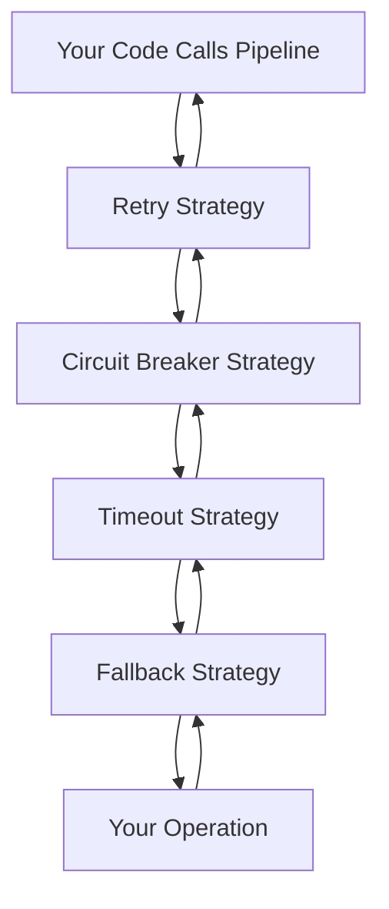

# Resilience Strategies Overview

Polly Dart provides six core resilience strategies that can be combined to build robust applications. Each strategy addresses specific failure scenarios and can be configured to match your application's needs.

## Strategy Categories

### 🔄 Reactive Strategies
These strategies respond to failures **after** they occur:

<div className="row">
  <div className="col col--6">
    <div className="card">
      <div className="card__header">
        <h3>🔄 Retry</h3>
      </div>
      <div className="card__body">
        <p><strong>Purpose:</strong> Automatically retry failed operations with configurable backoff strategies.</p>
        <p><strong>Use Case:</strong> Transient network failures, temporary service unavailability.</p>
        <a href="./retry" className="button button--primary">Learn More</a>
      </div>
    </div>
  </div>
  <div className="col col--6">
    <div className="card">
      <div className="card__header">
        <h3>⚡ Circuit Breaker</h3>
      </div>
      <div className="card__body">
        <p><strong>Purpose:</strong> Prevent cascading failures by temporarily blocking calls to failing services.</p>
        <p><strong>Use Case:</strong> Protecting against persistent failures, giving services time to recover.</p>
        <a href="./circuit-breaker" className="button button--primary">Learn More</a>
      </div>
    </div>
  </div>
</div>

<div className="row margin-top--md">
  <div className="col col--6">
    <div className="card">
      <div className="card__header">
        <h3>🎯 Fallback</h3>
      </div>
      <div className="card__body">
        <p><strong>Purpose:</strong> Provide alternative responses when primary operations fail.</p>
        <p><strong>Use Case:</strong> Graceful degradation, cached responses, default values.</p>
        <a href="./fallback" className="button button--primary">Learn More</a>
      </div>
    </div>
  </div>
  <div className="col col--6">
    <div className="card">
      <div className="card__header">
        <h3>🏁 Hedging</h3>
      </div>
      <div className="card__body">
        <p><strong>Purpose:</strong> Execute multiple parallel attempts and use the fastest successful response.</p>
        <p><strong>Use Case:</strong> Redundant services, optimizing for response time.</p>
        <a href="./hedging" className="button button--primary">Learn More</a>
      </div>
    </div>
  </div>
</div>

### ⚡ Proactive Strategies
These strategies prevent failures **before** they impact your system:

<div className="row margin-top--md">
  <div className="col col--6">
    <div className="card">
      <div className="card__header">
        <h3>⏱️ Timeout</h3>
      </div>
      <div className="card__body">
        <p><strong>Purpose:</strong> Cancel operations that take too long to complete.</p>
        <p><strong>Use Case:</strong> Preventing hanging requests, ensuring responsive UX.</p>
        <a href="./timeout" className="button button--primary">Learn More</a>
      </div>
    </div>
  </div>
  <div className="col col--6">
    <div className="card">
      <div className="card__header">
        <h3>🚦 Rate Limiter</h3>
      </div>
      <div className="card__body">
        <p><strong>Purpose:</strong> Control the rate of operations and manage concurrency.</p>
        <p><strong>Use Case:</strong> Preventing service overload, managing resource usage.</p>
        <a href="./rate-limiter" className="button button--primary">Learn More</a>
      </div>
    </div>
  </div>
</div>

## Strategy Execution Order

The order in which you add strategies to your pipeline matters. Strategies are applied in sequence, creating a nested execution flow:



### Example: Different Orders, Different Behaviors

```dart
// Order 1: Retry → Circuit Breaker → Timeout
final pipeline1 = ResiliencePipelineBuilder()
    .addRetry(RetryStrategyOptions(maxRetryAttempts: 3))
    .addCircuitBreaker()
    .addTimeout(Duration(seconds: 10))
    .build();

// Order 2: Circuit Breaker → Retry → Timeout  
final pipeline2 = ResiliencePipelineBuilder()
    .addCircuitBreaker()
    .addRetry(RetryStrategyOptions(maxRetryAttempts: 3))
    .addTimeout(Duration(seconds: 10))
    .build();
```

**Pipeline 1 Behavior:**
- Retry strategy sees circuit breaker results
- Circuit breaker sees individual operation attempts
- Each retry attempt gets its own 10-second timeout

**Pipeline 2 Behavior:**
- Circuit breaker sees retry results (fewer calls to track)
- Retry strategy works within circuit breaker state
- The entire retry sequence gets a 10-second timeout

## Choosing the Right Strategies

### Common Combination Patterns

#### Web API Calls
```dart
final webApiPipeline = ResiliencePipelineBuilder()
    .addRetry(RetryStrategyOptions(
      maxRetryAttempts: 3,
      delay: Duration(seconds: 1),
      backoffType: DelayBackoffType.exponential,
    ))
    .addCircuitBreaker(CircuitBreakerStrategyOptions(
      failureRatio: 0.5,
      breakDuration: Duration(seconds: 30),
    ))
    .addTimeout(Duration(seconds: 30))
    .addFallback(FallbackStrategyOptions.withValue('Cached response'))
    .build();
```

#### Database Operations
```dart
final databasePipeline = ResiliencePipelineBuilder()
    .addRetry(RetryStrategyOptions(
      maxRetryAttempts: 2,
      delay: Duration(milliseconds: 100),
    ))
    .addTimeout(Duration(seconds: 10))
    .build();
```

#### High-Frequency Operations
```dart
final highFrequencyPipeline = ResiliencePipelineBuilder()
    .addRateLimiter(RateLimiterStrategyOptions(
      permitLimit: 100,
      window: Duration(seconds: 1),
    ))
    .addTimeout(Duration(milliseconds: 500))
    .build();
```

#### Critical Real-Time Operations
```dart
final realTimePipeline = ResiliencePipelineBuilder()
    .addHedging(HedgingStrategyOptions(
      maxHedgedAttempts: 2,
      delay: Duration(milliseconds: 50),
      actionProvider: (args) => (context) => callBackupService(),
    ))
    .addTimeout(Duration(milliseconds: 200))
    .build();
```

## Strategy Compatibility Matrix

| Strategy 1 | Strategy 2 | Compatibility | Notes |
|------------|------------|---------------|-------|
| Retry | Circuit Breaker | ✅ Excellent | Order matters for behavior |
| Retry | Timeout | ✅ Excellent | Timeout per attempt vs total |
| Retry | Fallback | ✅ Excellent | Fallback after retries exhausted |
| Retry | Hedging | ⚠️ Caution | Can create exponential request growth |
| Circuit Breaker | Timeout | ✅ Excellent | Timeout prevents hanging during failures |
| Circuit Breaker | Fallback | ✅ Excellent | Fallback when circuit is open |
| Circuit Breaker | Rate Limiter | ✅ Good | Complementary protection mechanisms |
| Timeout | Fallback | ✅ Excellent | Fallback on timeout |
| Hedging | Rate Limiter | ⚠️ Caution | Rate limiting can block hedged attempts |

## Performance Considerations

### Strategy Overhead

| Strategy | Overhead | When Active |
|----------|----------|-------------|
| **Retry** | Low | Only on failures |
| **Circuit Breaker** | Very Low | Always (state tracking) |
| **Timeout** | Low | Always (timer setup) |
| **Fallback** | Very Low | Only on failures |
| **Hedging** | Medium | Always (parallel executions) |
| **Rate Limiter** | Low | Always (permit checking) |

### Memory Usage Guidelines

```dart
// ✅ Good: Reuse pipelines across operations
class ApiService {
  static final _pipeline = ResiliencePipelineBuilder()
      .addRetry()
      .addTimeout(Duration(seconds: 30))
      .build();
      
  Future<Data> fetchData() => _pipeline.execute(() => _httpGet('/data'));
}

// ❌ Bad: Creating pipelines per operation
Future<Data> fetchData() {
  final pipeline = ResiliencePipelineBuilder().addRetry().build(); // Don't do this
  return pipeline.execute(() => _httpGet('/data'));
}
```

## Configuration Best Practices

### 1. Start Simple
Begin with basic configurations and add complexity as needed:

```dart
// Start with this
final simple = ResiliencePipelineBuilder()
    .addRetry()
    .addTimeout(Duration(seconds: 30))
    .build();

// Evolve to this when you understand your failure patterns
final sophisticated = ResiliencePipelineBuilder()
    .addRetry(RetryStrategyOptions(
      maxRetryAttempts: 3,
      delay: Duration(seconds: 1),
      backoffType: DelayBackoffType.exponential,
      shouldHandle: (outcome) => isTransientError(outcome),
      onRetry: (args) => logRetryAttempt(args),
    ))
    .addCircuitBreaker(CircuitBreakerStrategyOptions(
      failureRatio: 0.6,
      minimumThroughput: 20,
      samplingDuration: Duration(minutes: 1),
      breakDuration: Duration(minutes: 5),
    ))
    .addTimeout(Duration(seconds: 30))
    .build();
```

### 2. Environment-Specific Configuration
```dart
final Duration timeout = isProduction 
    ? Duration(seconds: 30)
    : Duration(minutes: 5);  // Longer timeout for debugging

final int maxRetries = isProduction ? 3 : 1;  // Fewer retries in dev

final pipeline = ResiliencePipelineBuilder()
    .addRetry(RetryStrategyOptions(maxRetryAttempts: maxRetries))
    .addTimeout(timeout)
    .build();
```

### 3. Observability First
Always include logging and metrics:

```dart
final observablePipeline = ResiliencePipelineBuilder()
    .addRetry(RetryStrategyOptions(
      onRetry: (args) async {
        logger.warning('Retry attempt ${args.attemptNumber + 1} for ${args.context.operationKey}');
        metrics.incrementCounter('retries');
      },
    ))
    .addCircuitBreaker(CircuitBreakerStrategyOptions(
      onOpened: (args) async {
        logger.error('Circuit breaker opened');
        alerts.sendAlert('Service degradation detected');
      },
    ))
    .build();
```

## Testing Strategies

Each strategy provides mechanisms for testing:

```dart
// Test retry behavior
test('should retry on transient failures', () async {
  var attempts = 0;
  final pipeline = ResiliencePipelineBuilder()
      .addRetry(RetryStrategyOptions(maxRetryAttempts: 2))
      .build();

  try {
    await pipeline.execute((context) async {
      attempts++;
      if (attempts < 3) throw SocketException('Network error');
      return 'success';
    });
  } catch (e) {
    fail('Should have succeeded after retries');
  }
  
  expect(attempts, equals(3));
});

// Test circuit breaker behavior
test('should open circuit after threshold', () async {
  final circuitBreaker = CircuitBreakerStrategy(
    CircuitBreakerStrategyOptions(failureRatio: 0.5, minimumThroughput: 2)
  );
  
  // Cause failures to trip the circuit
  for (int i = 0; i < 3; i++) {
    try {
      await circuitBreaker.executeCore((context) async {
        throw Exception('failure');
      }, ResilienceContext());
    } catch (e) {}
  }
  
  expect(circuitBreaker.state, equals(CircuitState.open));
});
```

## Next Steps

Now that you understand the strategy landscape:

1. **Pick a strategy** that matches your immediate needs
2. **Study the detailed guides** for implementation patterns
3. **Experiment with combinations** to build comprehensive resilience
4. **Monitor and tune** your configurations based on real-world behavior

### Recommended Reading Order

For beginners:
1. [Retry Strategy](./retry) - Most commonly used
2. [Timeout Strategy](./timeout) - Essential for responsiveness  
3. [Fallback Strategy](./fallback) - User experience focused

For production systems:
1. [Circuit Breaker Strategy](./circuit-breaker) - Prevents cascading failures
2. [Rate Limiter Strategy](./rate-limiter) - Controls resource usage
3. [Hedging Strategy](./hedging) - Optimizes performance
